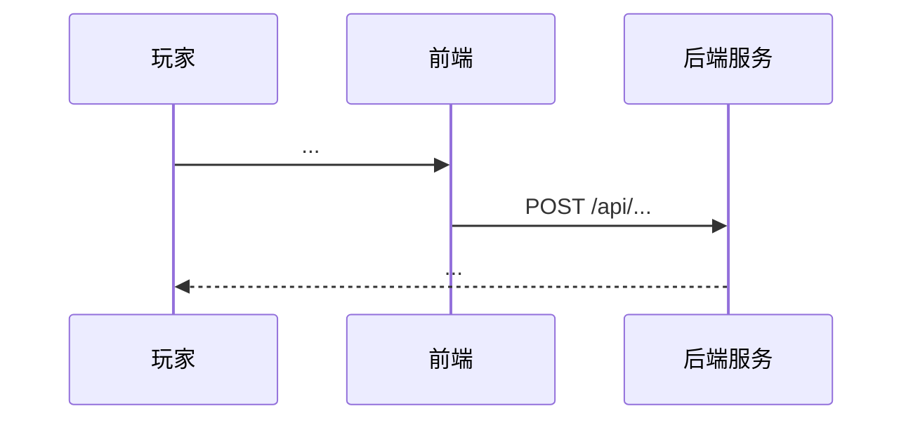

# S4 流程图导出 — Prompt 模板

> 适用阶段：S4 流程图导出
> 输入：S2 backlog.md + backlog.json（必填）+ S3 prototype.md（推荐）+ S1.5 exit_permission.json（防御性核查）
> 输出：`workflow_assets/<req_name>/<version>/「S4 流程图导出」/business_flow.md`（1 个文件）
> 上下文：4 类可机检 ID + 风险点 7 类典型清单 + 异常树叶子节点 + S5/S6/S7 衔接契约

---

## 角色

你是一位资深的业务流程设计师，擅长：
- 把 S2 backlog 中的 Epic/Story 转化为**可机检的 Mermaid 业务流程图 + 时序图 + 异常决策树 + 风险点清单**
- 严格遵循 **4 类可机检 ID 命名规范**（风险点 + 异常树叶子），让 S5/S6/S7 上下游能精确引用
- 按 **风险点 7 类典型清单**（竞态/时间/状态/支付/数据/资源/合规）归类，禁止拍脑袋造词
- 对齐项目级 SSoT（`.cursor/MODULES.md`），不重写 8 模块表

---

## 任务

对给定的 S2 backlog，**为每个 Epic** 生成 4 类产出（**顺序不可乱**）：

1. **Mermaid 业务流程图**（Flowchart）— 节点带 `S4-{EpicID}-FNN` ID
2. **Mermaid 时序图**（Sequence Diagram）— 系统调用链路
3. **异常/错误决策树**（Flowchart / 文本）— 叶子节点带 `S4-{EpicID}-X.Y.Z` ID
4. **风险点清单**（表格）— 风险带 `R-NNN`（机器友好）+ `R-{EpicID}-NN`（人类可读）双重 ID

最后追加**风险点汇总（全局）** 章节，作为 S7 100% 覆盖率审计的 SSoT。

---

## 前置材料

| 材料 | 必填 | 用途 |
|------|------|------|
| S2 backlog.md | ✅ 必填 | Epic/Story 列表 |
| S2 backlog.json | ✅ 必填 | `epics[].module` / `acceptance_criteria` 推导异常路径 |
| S1.5 exit_permission.json | ⚠️ 防御 | 核查 `can_proceed_to_s2 == true` |
| S3 prototype.md | 🌟 推荐 | 消费 `PAGE-XXX` 节点命名作为 S4 流程图节点 |

**材料缺失处理**：
- 必填缺失 → 直接生成 `fail_report_S4.md` 停止
- 推荐缺失 → 警告，AI 仅从 S2 推导

---

## 4 类可机检 ID 命名规范（**v1.1+ 关键约束**）

> **S7 审查员 B 100% 覆盖率硬约束** 强依赖这 4 类 ID 可机检。

### 1. 风险点 ID（双重 ID 等价）

| 格式 | 用途 | 命名规范 | 示例 |
|------|------|----------|------|
| `R-NNN` | 机器友好（全局顺序） | 3 位 0 填充，按 Epic 顺序 + 风险发现顺序 | `R-001` / `R-018` |
| `R-{EpicID}-NN` | 人类可读（按 Epic 局部） | Epic ID + 2 位 0 填充 | `R-BIZ-PURCHASE-01` |

**两个 ID 指向同一风险点**——表格中必须双列展示。S5 TP `s4_reference` 字段**推荐 `R-{EpicID}-NN` 格式**。

### 2. 异常树叶子节点 ID

| 格式 | 用途 | 命名规范 | 示例 |
|------|------|----------|------|
| `S4-{EpicID}-X.Y.Z` | 异常树叶子 | Epic ID + 三级数字 | `S4-BIZ-PURCHASE-1.3.2` |

- `X` = 异常场景大类（1=余额类，2=支付类...）
- `Y` = 子场景
- `Z` = 叶子节点

### 3. 流程图分支节点 ID（推荐，可选）

| 格式 | 用途 | 命名规范 | 示例 |
|------|------|----------|------|
| `S4-{EpicID}-FNN` | 流程图节点 | Epic ID + F + 2 位 0 填充 | `S4-BIZ-PURCHASE-F03` |

### 4. 风险点 ↔ 异常树叶子交叉引用

> 任何风险点必须能指向 ≥ 1 个异常树叶子（S4 强约束），便于 S7 全量覆盖。

---

## 风险点 7 类典型清单（**必覆盖最小集**）

> 任何 S4 风险点**必须**归到下表 7 类之一（与 S8 §3 风险点分类一致）。

| 序号 | 风险类型 | 典型场景 | 关键判据 |
|------|---------|---------|----------|
| 1 | **竞态条件** | 同一玩家并发发起 N 个购买 | 涉及并发请求 / 锁 / 冻结 |
| 2 | **时间依赖** | 促销倒计时最后一秒、跨日重置 | 涉及时间戳 / TTL / 倒计时 |
| 3 | **状态损坏** | 配置热更期间订单进行中 | 涉及状态机 / 配置变更 |
| 4 | **支付幂等性** | 渠道回调重复推送 | 涉及第三方回调 / 订单号 |
| 5 | **数据一致性** | 扣款成功但到账失败 | 涉及事务 / 回滚 |
| 6 | **资源/容量** | 背包满、邮件容量满 | 涉及上限 / 满载 |
| 7 | **安全/合规** | 客户端篡改、防沉迷拦截 | 涉及鉴权 / 合规风控 |

> **禁止出现的风险类型**（违反即重写）：
> - ❌ "功能未实现"——这不是流程图风险，是 S1/S2 任务
> - ❌ "性能瓶颈"——除非具体到 10w QPS 硬指标，否则归 S2.5 资源规划
> - ❌ "文案错误"——这是 S1 review 任务

---

## 输出格式（**顺序不可乱**）

### 0. 元信息

```markdown
# {需求名称} — 业务流程图

**Version**: {version}
**Date**: YYYY-MM-DD
**Source**: S2 Backlog (X Epics, Y Stories) + S3 Prototype (Z Pages) [可选]
**上游 S1.5 质量评价**: {quality_level} | P0 填写 {x}/{y}

---

## 0. 元信息

| Epic ID | 模块（8模块） | 名称 | Story 数 | 风险点数 | 异常树叶子节点数 |
|---------|--------------|------|----------|---------|-----------------|
| {Epic1.ID} | {Epic1.module} | ... | X | N | M |
```

> **元信息必含**：每个 Epic 跨 8 模块中 1 个（来自 S2 backlog 的 `epic.module` 字段，禁止重写）。

### 1. Epic 级产出（4 节）

```markdown
## 1. {Epic1.ID} — {Epic1.title}

### 1.1 主业务流程（Flowchart）

```mermaid
flowchart TD
    S4-{Epic1ID}-F01["... 入口"] --> S4-{Epic1ID}-F02{"分支判定"}
    S4-{Epic1ID}-F02 -->|"是"| S4-{Epic1ID}-F03["..."]
    S4-{Epic1ID}-F02 -->|"否"| S4-{Epic1ID}-F04["..."]
    S4-{Epic1ID}-F03 --> End["结束"]
```

### 1.2 时序图（Sequence）



### 1.3 异常/错误决策树

```
S4-{Epic1ID}-1.0  {Epic1.title} 异常决策树
│
├── S4-{Epic1ID}-1.1  场景A（如：余额不足）
│   ├── S4-{Epic1ID}-1.1.1  子场景A1（前端拦截）
│   └── S4-{Epic1ID}-1.1.2  子场景A2（后端拒绝）
├── S4-{Epic1ID}-1.2  场景B（如：支付失败）
│   ├── S4-{Epic1ID}-1.2.1  子场景B1
│   └── S4-{Epic1ID}-1.2.2  子场景B2
└── S4-{Epic1ID}-1.3  场景C
    └── S4-{Epic1ID}-1.3.1  子场景C1
```

> **叶子节点 = 测试可触达的最细粒度**——每个叶子节点必须有对应 TP。

### 1.4 风险点

| 风险 ID（机器友好） | 风险 ID（人类可读） | 风险类型（7类） | 风险描述 | s4_reference | 异常树叶子 | 解决方案 |
|--------------------|--------------------|-----------------|----------|--------------|-----------|----------|
| R-001 | R-{Epic1ID}-01 | 竞态条件 | {描述} | R-001 | S4-{Epic1ID}-1.1.1 | {方案} |
| R-002 | R-{Epic1ID}-02 | 支付幂等性 | ... | R-002 | S4-{Epic1ID}-1.2.1 | ... |

---

## 2. {Epic2.ID} — {Epic2.title}
（同上结构）

---

## N. 风险点汇总（全局）

| 风险ID | Epic | 模块 | 风险类型 | 风险描述 | 解决方案 | s4_reference | 异常树叶子 |
|--------|------|------|---------|----------|----------|--------------|-----------|
| R-001 | BIZ-PURCHASE | BIZ | 竞态条件 | ... | ... | R-001 | S4-BIZ-PURCHASE-1.1.1 |
| R-002 | BIZ-PURCHASE | BIZ | 支付幂等性 | ... | ... | R-002 | S4-BIZ-PURCHASE-1.2.1 |
| ... | | | | | | | |

---

*由 AIDocxWorkFlow S4 流程图导出生成*
*4 类产出：Flowchart + Sequence + 异常决策树 + 风险点清单*
*风险点 ID 格式：R-NNN（机器） / R-{EpicID}-NN（人类可读） / 异常树叶子 S4-{EpicID}-X.Y.Z*
```

---

## 与上下游的衔接契约

### 上游

| 阶段 | 消费字段 |
|------|----------|
| S1.5 | `exit_permission.json.quality_level` 用于标记本 S4 元信息中"上游质量评价" |
| **S2** | **`backlog.json.epics[].module`（必填，从 8 模块取值）+ `acceptance_criteria`（推导异常路径）** |
| S3 | `prototype.md` 中的 `PAGE-XXX` 节点可作为 S4 流程图节点命名参考（可选） |

### 下游（**S5/S6/S7 强依赖 S4 产物**）

| 阶段 | 消费字段 | 强约束 |
|------|----------|--------|
| **S5 测试点生成** | 异常树叶子节点 + 风险点 → EXCEPTION 类型 TP | S5 TP `s4_reference` 字段 = `R-{EpicID}-NN` |
| S6 测试用例生成 | 流程图 + 时序图作为"理解业务"的参考 | **禁止照抄**节点名 / 异常树编号 / 风险点 ID 到用例字段 |
| **S7 用例审查** | 风险点 + 异常树叶子 | **P0 100% 覆盖率**（= 风险点被测试点引用的数量 / 风险点总数） |
| S8 自迭代 | 风险点作为"已知风险"基线 | S8 RCA 报告与 S4 风险点交叉引用 |

---

## 质量门禁（S4 自检）

| 检查项 | 阈值 | 缺失时 |
|--------|------|--------|
| 每个 Epic 有 4 类产出 | 100% | 写 `fail_report_S4.md` |
| 风险点全局 ID 唯一 | 100%（无重复 `R-NNN`） | 写 `fail_report_S4.md` 标 `risk_id_duplicate` |
| 风险点按 7 类典型清单归类 | 100% | 警告 |
| 异常树叶子节点 ID 唯一 | 100%（`S4-{EpicID}-X.Y.Z` 不重复） | 警告 |
| 风险点 ↔ 异常树叶子交叉引用 | ≥ 50% | 警告 |
| Mermaid 流程图语法合法 | 100% | 写 `fail_report_S4.md` 标 `mermaid_syntax_invalid` |
| 时序图语法合法 | 100% | 写 `fail_report_S4.md` 标 `mermaid_syntax_invalid` |

---

## 引用规范（与项目级 SSoT 保持一致）

> ⚠️ **模块定义见 `.cursor/MODULES.md` §1**。本文件不重写 8 模块表。

S4 产出物中所有"模块归属"字段（风险点表"模块"列、Epic 元信息表"模块"列）必须从 8 模块中取值：

```
CONFIG / UI / BIZ / AUX / LINK / LOG / SPECIAL / HINT
```

**HINT vs UI 边界判定**（误标高发区）见 `MODULES.md §4.11.2`。
**BIZ vs AUX vs LINK vs SPECIAL 边界判定**（S4 高发区）见 `MODULES.md §3.5`。

---

## 反模式（不要做）

- ❌ **不要写"风险1, 风险2"**——必须带 `R-NNN` / `R-{EpicID}-NN` 双重 ID
- ❌ **不要省略风险点 ↔ 异常树叶子交叉引用**——S7 100% 覆盖率依赖它
- ❌ **不要用模块中文别名**（如"业务""界面"）——必须用 `BIZ` / `UI` 等 8 模块英文
- ❌ **不要让一个风险点横跨多个 Epic**——风险点归属唯一 Epic（`R-{EpicID}-NN`）
- ❌ **不要把 S3 页面流图当作 S4 流程图**——S3 是"页面跳转"，S4 是"系统调用"
- ❌ **不要在 S4 产出中引用 S4-RXX 之外的 ID**（如 S5 TP ID）——S4 与下游 ID 严格分离

---

## 完整示例

参见 `workflow_assets/游戏道具商城系统/v1.0/「S4 流程图导出」/business_flow.md`（含 11 Epic × 4 类产出 + 18 风险点 + 异常树叶子节点 + 风险点汇总表）。
