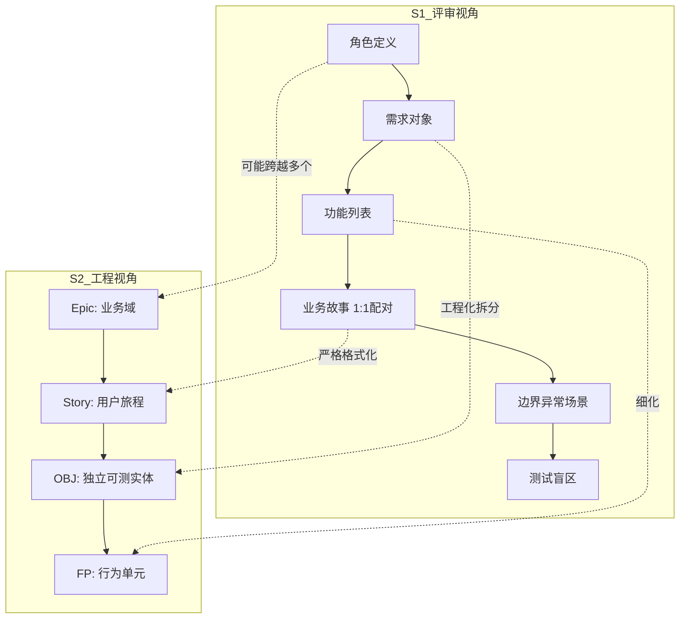

# S1 阶段系统化治理方案

> **问题来源**：用户上传《需求评审产出需求.docx》（资深测试评审产出框架），与当前 AIDocxWorkFlow S1 阶段实现存在差距。
> **目标**：明确 S1 职责边界、解决 requirement_objects.json 重复问题、建立概念分层矩阵。
> **版本**：v18 初次落地（基于用户标准文档 + 当前 S1/S2 实现对比分析）

---

## 一、核心问题诊断

### 问题 1：requirement_objects.json 重复产出

**现状**：

| 阶段 | 产物 | 路径 | 语义 |
|------|------|------|------|
| S1 | `requirement_objects.md` + `.json` | `「S1 需求评审」/` | 评审视角：角色→需求对象→功能→业务故事 |
| S2 | `requirement_objects.json` | `「S2 需求拆解」/` | 拆解视角：Epic→Story→OBJ→FP |

**根因**：S1 和 S2 都产出了名为 `requirement_objects` 的文件，但：
- S1 的视角是"评审"——从需求中抽取结构，供人阅读和 S1.5 澄清
- S2 的视角是"拆解"——按工程标准（Epic/Story/OBJ/FP）重新组织，供 S5/S6 使用

**问题**：两个文件的命名相同但语义不同，导致下游脚本消费时产生混淆。

### 问题 2：层级定义缺乏业务语义

**现状**：S2 定义了五层结构（Release/Epic/Story/OBJ/FP），但缺乏清晰的业务语义对照表：

| 层 | 当前定义 | 业务语义（缺失） |
|----|----------|----------------|
| Epic | 大系统/大型业务史诗 | "一个独立可灰度的业务域" |
| Story | 用户故事，可交付最小业务价值 | "一个完整用户旅程节点" |
| OBJ | Story 内独立业务载体 | "一个可单独验证的业务实体" |
| FP | 可独立断言的行为单元 | "一个最小测试粒度" |

### 问题 3：S1 职责范围不足（vs 用户标准）

**用户标准要求的 6 类产出**：

| # | 产出名称 | 当前状态 | 差距 |
|---|----------|----------|------|
| 1 | 需求评审问题记录表 | ❌ 未独立产出（问题散落在 clarification_checklist.md） | 需要独立文档 |
| 2 | 需求澄清定稿版 | ✅ 终版需求.md（已有） | 足够 |
| 3 | 需求可测性评估报告 | ⚠️ PURCHASE_STRONG 检查（部分覆盖） | 需要扩展 |
| 4 | 测试工作量排期预估单 | ❌ 缺失 | 需要新增 |
| 5 | 需求边界异常场景清单 | ❌ 缺失 | 需要新增 |
| 6 | 准入/退出提测标准 | ❌ 缺失 | 需要新增 |

---

## 二、需求评审产出矩阵

### 2.1 S1 vs S2 职责边界（决策）

| 维度 | S1 需求评审 | S2 需求拆解 |
|------|-------------|-------------|
| **核心职责** | 评审需求质量，发现问题 | 按工程标准拆解 Epic/Story/OBJ/FP |
| **视角** | 测试评审（找问题/评估风险/估算工时） | 需求工程（结构化拆解/分配 ID/分层） |
| **产出性质** | 评审报告（给人看/存档/人工审核） | 结构化数据（给机器读/下游消费） |
| **requirement_objects 定位** | `requirement_objects.md`（Markdown 可读版） | `requirement_objects.json`（S2 统一管理，分层结构） |

**决策**：
- ✅ S1 **保留** `requirement_objects.md`（Markdown 可读版，供 S1.5 人工审核）
- ✅ S1 **移除** `requirement_objects.json`（S1 阶段不产出结构化 JSON）
- ✅ S2 **统一管理** `requirement_objects.json`（Epic/Story/OBJ/FP 分层结构，供 S5/S6 消费）
- ✅ S1 在 `clarification_checklist.md` 中标注"需求对象"引用，与 S2 的 OBJ 区分语义

### 2.2 S1 完整产出矩阵（重构后）

#### 核心硬性产出（评审结束必须归档）

| # | 产物 | 格式 | 职责 | 触发条件 |
|---|------|------|------|----------|
| 1 | 需求评审问题记录表 | `review_issues.md` | 测试主导，记录所有发现的问题 | 始终产出 |
| 2 | 需求可测性评估报告 | `testability_assessment.md` | 评估需求好不好测、测试盲区 | 始终产出 |
| 3 | 需求边界异常场景清单 | `edge_cases.md` | 提前梳理异常/边界场景 | 始终产出 |
| 4 | 终版需求.md | `终版需求.md` | 策划输出定稿需求，测试校验确认 | 始终产出 |

#### 支撑产出（辅助核心产出）

| # | 产物 | 格式 | 职责 |
|---|------|------|------|
| 5 | review_report.md + .json | 5 维度评分报告 | 评分 + 判决 + 总结 |
| 6 | role_definitions.md | 角色定义 | 主/次/边界角色 + 典型场景 |
| 7 | requirement_objects.md | 需求对象拆解（Markdown） | 评审视角的拆解，不进 S2 数据流 |
| 8 | clarification_checklist.md | 待确认问题清单 | P0/P1/P2 + SPECIAL_FLAG，**含"问题需求清单"节** |

#### 流程管控产出（按需）

| # | 产物 | 格式 | 职责 | 方法论规范 |
|---|------|------|------|-----------|
| 9 | 测试工作量预估单 | `workload_estimation.md` | 模块拆分 + 各类工时 + 里程碑 | [S1_WORKLOAD_ESTIMATION.mdc](../rules/S1_WORKLOAD_ESTIMATION.mdc) |
| 10 | 准入退出标准 | `entry_criteria.md` | 提测门槛（功能/配套/文档准入） | [S1_ENTRY_CRITERIA.mdc](../rules/S1_ENTRY_CRITERIA.mdc) |
| 11 | 合规风险校验记录 | `compliance_check.md` | 防沉迷/充值弹窗/概率公示/版号合规 | [S1_COMPLIANCE_CHECK.mdc](../rules/S1_COMPLIANCE_CHECK.mdc) |

#### 资深测试专属产出（高阶）

| # | 产物 | 格式 | 职责 | 方法论规范 |
|---|------|------|------|-----------|
| 12 | 线上故障预判清单 | `risk_prevention.md` | 线上高风险场景预判 | 待建 |
| 13 | 自动化/性能测试规划 | `test_automation_plan.md` | 可自动化点 + 性能指标标准 | 待建 |

**产出精简原则**：
- 核心硬性产出（#1-4）：每个需求文档**必须归档**，缺一不可
- 支撑产出（#5-8）：S1 已有能力，**无需新增**
- 流程管控产出（#9-11）：按项目规模按需归档（小型项目可合并到 review_report.md）
  - **#9 测试工作量预估单**：已建立方法论规范 [S1_WORKLOAD_ESTIMATION.mdc](../rules/S1_WORKLOAD_ESTIMATION.mdc)
  - #10 准入退出标准：待建方法论规范
  - #11 合规风险校验：待建方法论规范
- 资深测试专属产出（#12-13）：大型/重度商业化项目按需产出

### 2.3 S1 vs S2 产出对比矩阵

| 产物 | S1 产出 | S2 产出 | 关系 |
|------|---------|---------|------|
| 需求评审问题记录表 | `review_issues.md` | — | 独立，S1 人工审核后归档 |
| 终版需求 | `终版需求.md` | — | S1.5 完善后作为 S2 输入 |
| requirement_objects | `requirement_objects.md` | `requirement_objects.json` | **语义不同**，S1 Markdown vs S2 JSON 分层 |
| backlog | — | `backlog.md` + `.json` | S2 独立产出 |
| 需求对象 | S1 作为评审视角拆解 | S2 作为 OBJ 单元 | S2 OBJ = S1 评审对象的工程化 |

---

## 三、概念分层矩阵

### 3.1 S1 视角 vs S2 视角对照

| 概念 | S1 评审视角 | S2 工程视角 | 映射关系 |
|------|-------------|-------------|----------|
| **Epic** | 大业务域（隐含在角色定义中） | `CONFIG-001` / `BIZ-001` 等 8 模块前缀 | S1 角色定义可能涉及多个 Epic |
| **Story** | 业务故事（功能 + 业务价值） | `CONFIG-001-001` 等用户故事 | S1 业务故事 ≈ S2 Story（但 S2 更严格） |
| **OBJ（需求对象）** | 需求对象（待测试主体） | `CONFIG-001-001-OBJ-01`（独立可测实体） | S1 需求对象可能拆出多个 S2 OBJ |
| **FP（功能点）** | 功能描述（输入→处理→输出） | FP（可独立断言的行为单元） | S1 功能 ≈ S2 FP 的上游输入 |

### 3.2 S2 Epic/Story/OBJ/FP 业务语义定义（v18 SSOT）

> **本节是 S2 层级的业务语义定义**，替代 STAGE_S2_BREAKDOWN.mdc 中模糊的"大系统/用户故事"描述。

| 层 | 业务语义 | 判别口诀 | 典型示例 |
|----|----------|----------|----------|
| **Epic** | "一个可独立灰度/开关的业务域" | "这东西能单独上线吗？" | 充值系统、VIP 系统、商城系统 |
| **Story** | "一个完整用户旅程节点" | "用户做了一件什么事？" | "玩家购买月卡"、"玩家使用兑换码" |
| **OBJ** | "Story 内一个可单独验证的业务实体" | "这东西能单独测吗？" | 支付弹窗 OBJ、订单服务 OBJ、发货记录 OBJ |
| **FP** | "一个最小可断言的行为单元" | "这个只能通过是/否判断吗？" | "月卡生效后 VIP 状态变为 true"、"月卡过期后每日奖励消失" |

### 3.3 S1 评审对象 vs S2 工程单元对照表

| S1 评审对象 | S1 典型描述 | S2 工程单元 | 映射说明 |
|-------------|-------------|-------------|----------|
| 角色 | "玩家、运营、GM" | Epic 的 user_role | Epic 按模块分，Story 按角色分 |
| 需求对象 | "商城下单、支付回调、发奖" | OBJ（独立可测实体） | 1 个 S1 需求对象可能 = 1-N 个 S2 OBJ |
| 功能 | "输入→处理→输出" | FP（行为单元） | 1 个 S1 功能可能 = 1-N 个 S2 FP |
| 业务故事 | "作为玩家，我希望..." | Story（用户故事） | 基本 1:1 映射，但 S2 有更严格的格式要求 |

### 3.4 概念关系图（Mermaid）

---

## 四、transition plan（S1 产出矩阵落地）

### 4.1 分阶段迁移

**Phase 1（立即）**：
- [ ] S1 移除 `requirement_objects.json` 产出（改为仅输出 `.md`）
- [ ] S1 新增 3 个独立产出：`review_issues.md` / `edge_cases.md` / `testability_assessment.md`
- [ ] STAGE_S1_REVIEW.mdc 更新产出矩阵
- [ ] aidocx-s1-review/SKILL.md 更新产出矩阵

**Phase 2（按需）**：
- [ ] S1 新增 `workload_estimation.md` / `entry_criteria.md`（按需归档）
- [ ] `requirement_reviewer_auto.py` 新增辅助函数

**Phase 3（后续迭代）**：
- [ ] S7/S8 考虑引入线上故障预判和自动化测试规划

### 4.2 改动影响范围

| 文件 | 改动类型 | 说明 |
|------|----------|------|
| `STAGE_S1_REVIEW.mdc` | 重写产出矩阵 | 移除 requirement_objects.json，新增 3 个独立文档 |
| `aidocx-s1-review/SKILL.md` | 对齐更新 | 与 Rule 同步 |
| `MODULES.md` | 不改 | 8 模块定义与 S1 产出无关 |
| `ai_workflow/requirement_reviewer_auto.py` | 新增函数 | 辅助生成 review_issues / edge_cases / testability_assessment |

---

## 五、open_questions（待用户决策）

| ID | 问题 | 选项 | 影响 |
|----|------|------|------|
| Q-S1-001 | S1 移除 `requirement_objects.json` 后，旧项目的 S1 产物如何兼容？ | A: 不兼容，仅新项目用新格式 / B: 提供迁移脚本 | 影响历史项目 |
| Q-S1-002 | `requirement_objects.md` 是否需要在 S1.5 完善后更新？ | A: 是，同步更新 / B: 否，保持 S1 草稿不变 | 影响 S1.5 流程 |
| Q-S1-003 | 流程管控产出（工时预估/准入标准）是否设为必选？ | A: 必选 / B: 按项目规模可选 / C: 仅大型项目必选 | 影响 S1 执行成本 |
| Q-S1-004 | S1 的 5 维度评分是否需要与可测性评估合并？ | A: 合并为"质量评分" / B: 保持独立（5 维度评分 + 可测性报告） | 影响 S1 输出结构 |

---

## 六、changelog

| 版本 | 日期 | 变更 |
|------|------|------|
| v18 | 2026-07-20 | 初版落地：建立 S1 vs S2 职责边界矩阵 / 需求评审产出矩阵 / 概念分层矩阵 / transition plan |
| v18.2 | 2026-07-20 | 新增 #10 准入退出标准方法论规范 [S1_ENTRY_CRITERIA.mdc](../rules/S1_ENTRY_CRITERIA.mdc) + #11 合规风险校验方法论规范 [S1_COMPLIANCE_CHECK.mdc](../rules/S1_COMPLIANCE_CHECK.mdc) |
