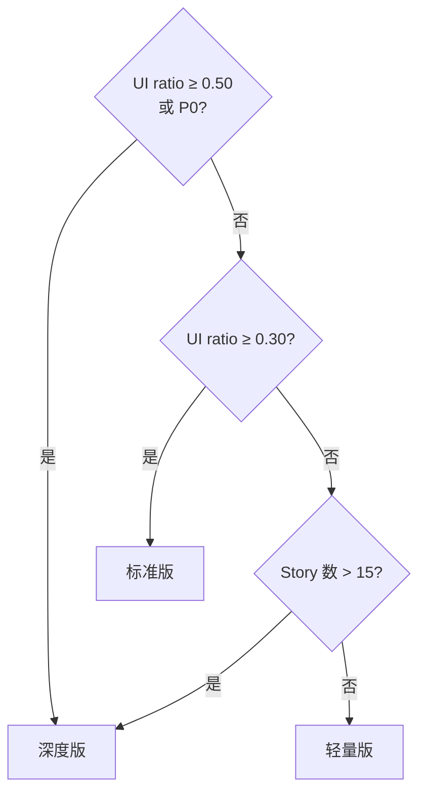

# v15 增强路径经验归档

> **来源**：v15 §5 阶段 2 任务 5-6
> **执行日期**：2026-07-16

---

## 1. 核心决策

### 1.1 三档路径阈值确定

**最终阈值**（D-V15-002 拍板）：

| 路径 | UI ratio | 风险等级 | Story 数 | P0 规则 |
|---|---|---|---|---|
| 轻量版 | < 0.30 | P2 | ≤ 5 | — |
| 标准版（默认）| 0.30-0.50 | P1 | 6-15 | — |
| 深度版 | > 0.50 | P0 | > 15 | P0 强制 |

**阈值确定过程**：
- v14 外部方案 §4.2 建议：UI ratio > 0.30 → 深度版
- v15 实战调整：细分为三档，深度版拆分出"超大型需求"（UI ratio > 0.50）
- 理由：UI ratio > 0.50 时仅靠页面流图不够，需补充用户旅程图

### 1.2 嵌入位置决策

**S3 SKILL.md §23**：加决策树图示（Mermaid flowchart）

**S2 SKILL.md §409**：加 `s3_mode_reasons` 字段

**理由**：
- S3 是执行层（prompt 直接影响 LLM 行为）
- S2 是信息层（`s3_mode_reasons` 让 Agent 记录决策依据，方便审查）

---

## 2. 实现细节

### 2.1 S3 SKILL.md §23 决策树（Mermaid）



### 2.2 S2 s3_mode_reasons 字段

```json
{
  "s3_mode": "standard",
  "s3_mode_reasons": {
    "ui_ratio": 0.35,
    "story_count": 10,
    "risk_level": "P1",
    "forced_by_p0": false,
    "triggered_by_ui_ratio": true
  }
}
```

---

## 3. 已知的局限

| 局限 | 影响 | 缓解措施 |
|---|---|---|
| UI ratio 计算依赖 S2 Story 正确分类 | 分类错则触发条件不准 | S2 §408 明确 UI 类 Story 定义 |
| Story 数阈值（15）是经验值 | 可能需试点调整 | v15 试点后微调 |
| 三档产出版本不一致 | QA 培训成本 | 建立各档产出示例库（v16 任务）|

---

## 4. 执行记录

- 2026-07-16 新建本文件
- 2026-07-16 S3 §23 加决策树图示 ✅
- 2026-07-16 S2 §409 加 `s3_mode_reasons` 字段 ✅
- 2026-07-16 D-V15-002 拍板 ✅（三档阈值）
