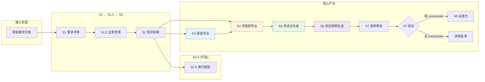
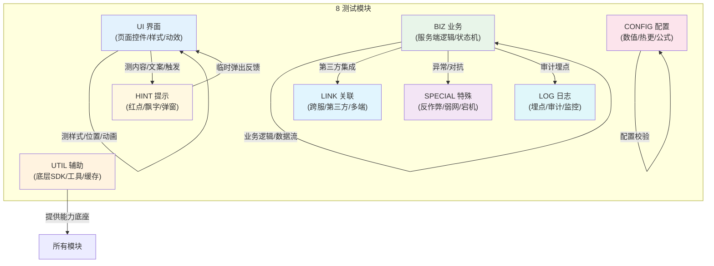
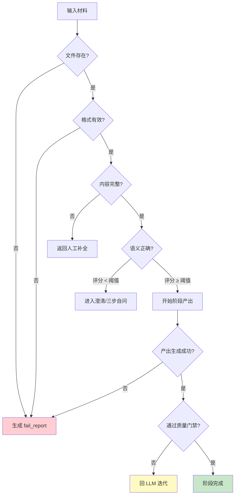
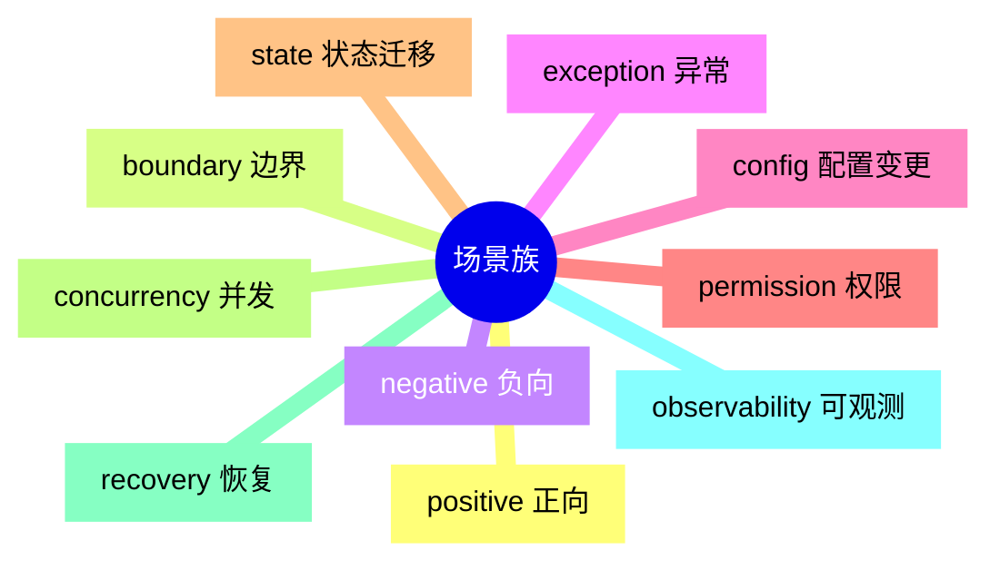
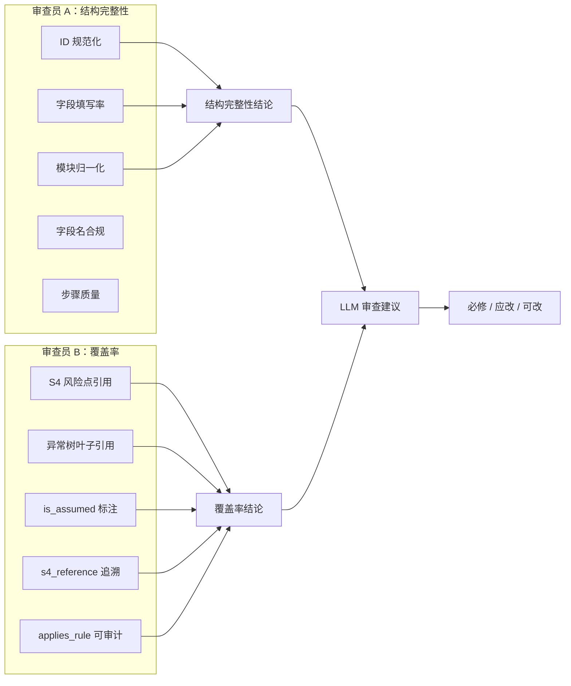
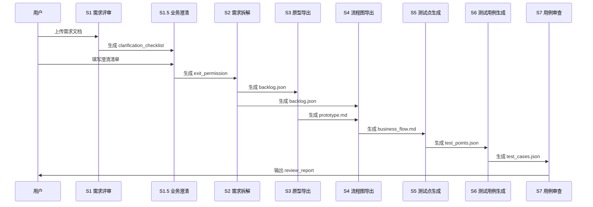
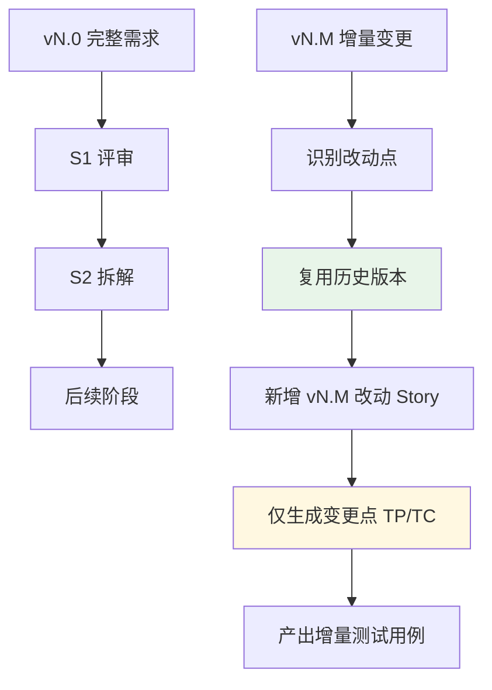

# AIDocxWorkFlow 产品说明文档

> **版本**: v1.0
> **日期**: 2026-07-17
> **目标读者**: 产品经理、测试工程师、项目管理者、技术负责人

---

## 目录

1. [产品概述](#1-产品概述)
2. [核心架构：9 阶段流水线](#2-核心架构9-阶段流水线)
3. [8 模块测试分类体系](#3-8-模块测试分类体系)
4. [质量门禁体系](#4-质量门禁体系)
5. [关键概念解释](#5-关键概念解释)
6. [方法论详解](#6-方法论详解)
7. [典型工作流程](#7-典型工作流程)
8. [快速入门](#8-快速入门)
9. [Goal Loop 自治循环](#9-goal-loop-自治循环)

---

## 1. 产品概述

### 1.1 是什么

**AIDocxWorkFlow** 是一套 AI 驱动的测试用例生成流水线系统。它从原始需求文档（DOCX/Markdown）出发，通过结构化的 9 阶段处理流程，自动产出高质量的测试用例、流程图和审查报告。

### 1.2 解决什么问题

| 问题 | 解决方案 |
|-----|---------|
| 测试用例质量参差不齐 | 8 模块分类体系 + 质量门禁 |
| 需求到测试的转化效率低 | 端到端自动化流水线 |
| 异常/边界场景容易遗漏 | 4 类产出 + 风险点清单 |
| 测试覆盖不完整 | 双层覆盖率追踪（OBJ + FP）|
| 迭代改进缺乏依据 | S7/S8 审查 + 根因分析 |

### 1.3 核心特点

```
┌─────────────────────────────────────────────────────────────┐
│  🎯 设计优先    📋 8 模块分类    ⚡ 端到端自动化            │
│  🔍 质量门禁    📊 双层覆盖率    🔄 持续自迭代              │
└─────────────────────────────────────────────────────────────┘
```

---

## 2. 核心架构：9 阶段流水线

### 2.1 阶段总览

```
┌──────────────────────────────────────────────────────────────────────────┐
│                        AIDocxWorkFlow 9 阶段流水线                        │
├──────────────────────────────────────────────────────────────────────────┤
│                                                                          │
│  ┌─────┐    ┌──────┐    ┌─────┐    ┌─────┐    ┌─────┐              │
│  │ S1  │───▶│ S1.5 │───▶│ S2  │───▶│ S2.5│───▶│ S3  │              │
│  │需求  │    │业务  │    │需求  │    │迭代  │    │原型  │              │
│  │评审  │    │澄清  │    │拆解  │    │规划  │    │导出  │              │
│  └─────┘    └──────┘    └─────┘    └─────┘    └─────┘              │
│    │          │           │           │            │                    │
│    │          │           │           │            │                    │
│    ▼          ▼           ▼           ▼            ▼                    │
│  ┌─────┐              ┌─────┐              ┌─────┐    ┌─────┐          │
│  │ 失败 │              │ backlog │              │流程图 │    │测试点 │    │
│  │ 报告 │              │  .json  │              │导出  │    │生成  │    │
│  └─────┘              └─────┘              └─────┘    └─────┘          │
│                                                          │              │
│                                                          ▼              │
│                                               ┌─────────────────┐         │
│                                               │     S6 → S7 → S8       │
│                                               │  测试用例 → 审查 → 迭代  │
│                                               └─────────────────┘         │
│                                                                          │
└──────────────────────────────────────────────────────────────────────────┘
```

### 2.2 阶段详细说明

| 阶段 | 名称 | 核心输入 | 核心输出 | 关键指标 |
|------|------|---------|---------|---------|
| **S1** | 需求评审 | 原始需求文档 | 终版需求.md + clarification_checklist | 评分 ≥ 7.0 |
| **S1.5** | 业务澄清 | 人工填写的澄清清单 | exit_permission.json | P0 项 100% 填写 |
| **S2** | 需求拆解 | 终版需求 + exit_permission | backlog.md/json + requirement_objects | Epic 拆解精度 ≥ 90% |
| **S2.5** ⏺ | 迭代规划 | backlog | iteration_plan | （可选） |
| **S3** ⭐ | 原型导出 | backlog | prototype.md + PAGE-XXX 节点 | 4 类产出 100% |
| **S4** | 流程图导出 | backlog + prototype | business_flow.md + 风险点清单 | 异常覆盖率 = 100% |
| **S5** | 测试点生成 | backlog | test_points.json | FP 覆盖率 = 100% |
| **S6** | 测试用例生成 | test_points.json | test_cases.json | 字段填写率 ≥ 90% |
| **S7** | 用例审查 | test_cases.json | review_report.json | 覆盖率数字 + LLM 判断 |
| **S8** | 自迭代 | review_report | iteration.md | 可执行建议 ≥ 3 |

> ⭐ = 必产阶段，不可跳过  
> ⏺ = 可选阶段，默认跳过

### 2.3 阶段依赖关系图



---

## 3. 8 模块测试分类体系

### 3.1 模块总览

| 模块 | 前缀 | 中文 | 职责边界 | 测试类型数 |
|------|------|------|---------|----------|
| **CONFIG** | `CONFIG-` | 配置 | 配置表结构与字段合法性、数值公式、热更新 | 9 |
| **UI** | `UI-` | 界面 | 前端 UI 层：控件渲染/状态/交互/布局 | 11 |
| **BIZ** | `BIZ-` | 业务 | 服务端业务逻辑、端服数据流、状态机 | 9 |
| **UTIL** | `UTIL-` | 辅助 | 底层通用工具、SDK、缓存、网络底层 | 14 |
| **LINK** | `LINK-` | 关联 | 跨服务/多端/第三方业务互通 | 6 |
| **SPECIAL** | `SPECIAL-` | 特殊 | 非正常/极端/对抗性场景（反作弊/弱网/宕机）| 9 |
| **LOG** | `LOG-` | 日志 | 埋点规范、审计流水、日志完整性 | 13 |
| **HINT** | *(无)* | 提示 | 临时反馈组件（红点/飘字/弹窗）| 13 |

### 3.2 模块关系图



### 3.3 模块边界判定

```
┌─────────────────────────────────────────────────────────────────────────┐
│                        模块归属快速判定表                                  │
├─────────────────────────────────────────────────────────────────────────┤
│                                                                          │
│  新元素 → 是玩家可见界面元素？                                            │
│    ├─ 是 → 是页面常驻控件 还是事件触发临时提示？                          │
│    │     ├─ 常驻控件/样式/动画  → UI                                     │
│    │     └─ 临时/飘字/红点/Toast → 测样式 还是测内容？                  │
│    │             ├─ 样式/位置/动画 → UI                                  │
│    │             └─ 内容/触发/文案 → HINT                               │
│    │                                                                          │
│    └─ 否 → 是配置表字段 还是业务规则？                                    │
│          ├─ 配置表/参数/价格表  → CONFIG                                 │
│          └─ 业务规则/状态机/扣款 → 常规业务 还是异常/对抗？              │
│                  ├─ 常规/协议/数据流 → BIZ                                │
│                  └─ 异常/对抗/弱网/反作弊 → SPECIAL                      │
│                                                                          │
│  新元素 → 是底层通用工具？                                               │
│    ├─ 底层工具/SDK/加密/网络  → UTIL                                     │
│    └─ 业务辅助 → 测行为轨迹 还是互通一致性？                            │
│            ├─ 埋点/审计/监控    → LOG                                   │
│            └─ 跨服/跨端/外部三方 → LINK                                 │
│                                                                          │
└─────────────────────────────────────────────────────────────────────────┘
```

### 3.4 模块 × 测试类型矩阵

| 模块 | 必须覆盖的测试类型 | 典型场景 |
|------|------------------|---------|
| **CONFIG** | 字段合法性、同表一致性、跨表依赖、热更新、版本兼容 | VIP 等级配置表、价格公式 |
| **UI** | 控件渲染、控件状态、纯交互、布局适配、动效、引导 | 购买按钮点击、页面切换动画 |
| **BIZ** | 业务逻辑、数据流、协议交互、状态机、数据库持久化、并发 | 扣除游戏币、发货道具 |
| **UTIL** | 公共工具、网络层、缓存、资源管理、离线更新 | 网络重连、缓存命中率 |
| **LINK** | 内部业务联动、跨服同步、多端一致、第三方集成 | 微信支付回调、跨服组队 |
| **SPECIAL** | 边界极端、反作弊、弱网/限流、前后台切换、宕机 | 客户端篡改检测、弱网下单 |
| **LOG** | 行为埋点、资产审计、操作日志、监控埋点、崩溃报告 | 货币变动流水、错误堆栈 |
| **HINT** | 红点角标、飘字、Toast、弹窗、限时提醒、合规提示 | 获得道具飘字、红点提醒 |

---

## 4. 质量门禁体系

### 4.1 门禁总览

| 阶段 | 门禁类型 | 判定规则 | 三步自问例外 |
|------|---------|---------|------------|
| S1 | 评分门禁 | ≥ 7.0/10.0 | ⚠️ 低阈值时触发 |
| S1.5 | 字段门禁 | P0 项 100% 填写 | ⚠️ P0 漏填时触发 |
| S2 | 精度门禁 | Epic 拆解精度 ≥ 90% | ⚠️ 未达精度时触发 |
| S3 | 结构门禁 | 4 类产出 100% | ❌ 无例外 |
| S4 | 结构门禁 + 覆盖率门禁 | 4 类产出 + 异常覆盖率 = 100% | ✅ 显式标注未覆盖原因 |
| S5 | 指导建议 + 覆盖率门禁 | ≥ 6 TP/Story（指导值）| ✅ 已可灵活调整 |
| S6 | 完整性门禁 + 双层覆盖率 | 字段填写率 ≥ 90% + OBJ 覆盖率 = 100% + FP 覆盖率 = 100% | ⚠️ 低于 90% 时触发 |
| S7 | 覆盖率门禁 | 无硬阈值 | ❌ 无硬阈值 |

### 4.2 门禁流程图



### 4.3 三步自问决策树

当硬性门禁未通过时：

```
┌─────────────────────────────────────────────────────────────────────────┐
│                      三步自问决策树（例外条款）                          │
├─────────────────────────────────────────────────────────────────────────┤
│                                                                          │
│  gate 未达标                                                            │
│      ↓                                                                 │
│  Q1：该字段/指标在本业务场景下是否实际存在？                             │
│      │                                                                 │
│      ├─ 存在 → ❌ 必须补充，回 LLM 迭代                                │
│      │                                                                 │
│      └─ 不存在 → 进入 Q2                                               │
│              ↓                                                         │
│  Q2：上游材料是否提供了该字段/指标的来源信息？                          │
│      │                                                                 │
│      ├─ 有 → ❌ 必须补充                                               │
│      │                                                                 │
│      └─ 无 → 进入 Q3                                                   │
│              ↓                                                         │
│  Q3：该缺失是否影响后续阶段的可执行性或产出完整性？                      │
│      │                                                                 │
│      ├─ 影响 → ❌ 必须补充                                             │
│      │                                                                 │
│      └─ 不影响 → ✅ 允许放行，备案到 bypass_log.json                   │
│                                                                          │
└─────────────────────────────────────────────────────────────────────────┘
```

### 4.4 例外率监控

| 预警等级 | 阈值 | 触发动作 |
|---------|------|---------|
| 🟡 黄色预警 | 例外率 > 20% | S7 输出提示，人工关注 |
| 🔴 红色预警 | 例外率 > 40% | 建议暂停，重新评估需求质量 |

**例外率计算**：
```
单项目例外率 = 触发三步自问的门禁项数 ÷ 该项目经过的所有门禁项总数 × 100%
```

**10 项门禁分母**：
```
S1(1) + S1.5(1) + S2(1) + S4(2) + S5(2) + S6(3) = 10 项
```

---

## 5. 关键概念解释

### 5.1 Epic / Story / OBJ / FP

| 层级 | 定义 | 示例 |
|------|------|------|
| **Epic** | 最大需求单元，对应一个完整功能模块 | `BIZ-PURCHASE` 购买模块 |
| **Story** | 用户故事，对应一个具体功能场景 | `BIZ-PURCHASE-001` 单次购买 |
| **OBJ (需求对象)** | 需求中的实体对象 | `OBJ-01` 订单对象 |
| **FP (功能点)** | OBJ 的具体功能 | `FP-01` 计算订单总价 |

### 5.2 TP / TC / 场景族

| 层级 | 定义 | 关系 |
|------|------|------|
| **TP (测试点)** | 测试设计的最小单元 | Story → N 个 TP |
| **TC (测试用例)** | 可执行的测试步骤 | TP → 1:N TC |
| **场景族** | 测试场景的分类 | 10 类必扫场景族 |

**10 类必扫场景族**：



### 5.3 四象限展开

| 象限 | 名称 | 内容 | 最低要求 |
|------|------|------|---------|
| **Q1** | 功能性 | 正常/异常/边界/状态 | ≥ 3 类场景族 |
| **Q2** | 非功能性 | 性能/安全/兼容/可用性 | ≥ 1 类 |
| **Q3** | 业务域交互 | 模块 × 模块交互 | ≥ 1 类 |
| **Q4** | 工程域 | 配置/日志/缓存 | ≥ 1 类 |

### 5.4 覆盖率指标

| 指标 | 计算公式 | 阈值 |
|------|---------|------|
| OBJ 覆盖率 | TP 引用的 OBJ 数 ÷ S2 OBJ 总数 | = 100% |
| FP 覆盖率 | TP 引用的 FP 数 ÷ S2 FP 总数 | = 100% |
| UI 节点覆盖率 | TP 引用的 UI 节点数 ÷ prototype.md 节点数 | = 100% |
| 异常路径覆盖率 | S5 TP 引用异常树叶子数 ÷ S4 产出叶子总数 | = 100% |

---

## 6. 方法论详解

### 6.1 16 种测试方法学体系

| # | 方法学 | 核心思路 | 主要适用 |
|---|-------|---------|---------|
| 1 | 等价类划分 | 把输入域划分为等价类，从每类取代表值 | 输入枚举 |
| 2 | 边界值分析 | 取等价类边界（-1/边界/+1） | 数值/长度/时间 |
| 3 | 判定表驱动 | 条件/动作穷举组合 | 多条件业务规则 |
| 4 | 因果图 | 输入→结果因果关系 | 复杂逻辑依赖 |
| 5 | 正交实验法 | N 因子 K 水平正交覆盖 | 多参数组合 |
| 6 | 状态迁移测试 | 状态机合法/非法转换 | 状态机业务 |
| 7 | 状态转换覆盖 | N-switch / 0-switch 路径覆盖 | 状态机深度 |
| 8 | 路径覆盖 | 语句/分支/条件/路径 | 流程逻辑 |
| 9 | 场景法 | 业务场景模拟 | E2E 业务流 |
| 10 | 错误猜测 | 基于经验列可能错误 | 防御性测试 |
| 11 | 探索性测试 | 边测边设计 | 不可预知场景 |
| 12 | 基于检查表 | 通用检查清单 | UI/兼容性/无障碍 |
| 13 | 基于规格 | 严格按需求逐项 | 合规测试 |
| 14 | 基于风险 | 高风险优先覆盖 | 优先级排序 |
| 15 | 基于经验 | 测试人员经验库 | 回归缺陷 |
| 16 | 变异测试 | 注入故障验证检测 | 鲁棒性/容错 |

**覆盖率要求**：
- 每条 TC：`methodology_tag` ≥ 2 种
- 每个功能：union ≥ 4 种
- 全局：≥ 8 种

### 6.2 双审查员制度（S7）



### 6.3 根因追溯链路（S8）

```
┌─────────────────────────────────────────────────────────────────────────┐
│                        S8 根因追溯 4 步法                               │
├─────────────────────────────────────────────────────────────────────────┤
│                                                                          │
│  症状 ──── S7 必修项 / 应改项                                            │
│      ↓                                                                  │
│  根因层 1 ── 具体缺口：哪些 R-NNN 或异常树节点未被覆盖？                │
│      ↓                                                                  │
│  根因层 2 ── S5 层缺失：这些风险点/异常节点是否在 test_points.json 中？│
│      ↓                                                                  │
│  根因层 3 ── 根本原因判定：                                            │
│                                                                          │
│      ├─ S4_PROVIDE  → S4 未提供足够的风险点                            │
│      ├─ S4_NAME     → S4 Epic 命名误导了 S5 模块判定                   │
│      ├─ S5_RULE     → S5 规则未明确要求引用 S4                         │
│      ├─ S5_EXEC     → S5 执行时遗漏了风险点                            │
│      ├─ S5_MODULE   → S5 TP 模块归属错误                               │
│      ├─ S2_OBJ      → S2 拆 OBJ 时违反跨模块拆分规则                   │
│      ├─ S2_RULE     → S2 规则未明确跨模块拆分要求                      │
│      └─ S6_EXEC     → S6 步骤质量差                                    │
│                                                                          │
└─────────────────────────────────────────────────────────────────────────┘
```

---

## 7. 典型工作流程

### 7.1 完整流水线执行



### 7.2 增量迭代流程



### 7.3 目录结构

```
workflow_assets/
 <req_name>/
 <version>/
 「S1 需求评审」/
 raw/                          # 原始物料
 extracted/                    # 提取加工后的物料
 review_report.md             # S1 评审报告
 clarification_checklist.md   # 待确认问题清单
 终版需求.md                  # 最终需求
 exit_permission.json         # 准出许可

 「S2 需求拆解」/
 backlog.md / backlog.json    # Epic/Story 层
 requirement_objects.md/json   # OBJ/FP 层

 「S3 原型导出」/
 prototype.md                # 页面原型 + PAGE-XXX 节点

 「S4 流程图导出」/
 business_flow.md            # 流程图 + 风险点清单

 「S5 测试点生成」/
 test_points.json            # 测试点
 coverage_ledger.json         # 覆盖账本
 omission_ledger.json         # 遗漏账本

 「S6 测试用例生成」/
 test_cases.json             # 测试用例
 coverage_ledger.json
 omission_ledger.json

 「S7 用例审查」/
 review_report.md/json        # 审查报告
```

---

## 8. 快速入门

### 8.1 触发命令

| 命令 | 阶段 | 说明 |
|------|------|------|
| `/aidocx-s1-review` | S1 | 需求评审 |
| `/aidocx-s1-5-clarification` | S1.5 | 业务澄清 |
| `/aidocx-s2-breakdown` | S2 | 需求拆解 |
| `/aidocx-s2-5-iteration` | S2.5 | 迭代规划（可选）|
| `/aidocx-s3-prototype` | S3 | 原型导出 |
| `/aidocx-s4-flowchart` | S4 | 流程图导出 |
| `/aidocx-s5-test-points` | S5 | 测试点生成 |
| `/aidocx-s6-test-cases` | S6 | 测试用例生成 |
| `/aidocx-s7-review` | S7 | 用例审查 |
| `/aidocx-s8-self-iteration` | S8 | 自迭代 |

### 8.2 输入材料准备

| 阶段 | 最低输入 | 推荐输入 |
|------|---------|---------|
| S1 | 原始需求文档（DOCX/MD）| 需求文档 + 原型图 + 数据字典 |
| S2 | 终版需求.md + exit_permission.json | + 历史 backlog（参考）|
| S3 | backlog.json | + 竞品原型（参考）|
| S4 | backlog.json + prototype.md | + 详细需求说明 |
| S5 | backlog.json + business_flow.md | + 历史 TP（参考）|
| S6 | test_points.json | + 用例模板（参考）|

### 8.3 输出产物清单

| 阶段 | 主要产物 | 附产物 |
|------|---------|-------|
| S1 | review_report.md, 终版需求.md | clarification_checklist.md |
| S1.5 | exit_permission.json | clarification_report.md |
| S2 | backlog.json, requirement_objects.json | — |
| S3 | prototype.md | — |
| S4 | business_flow.md | 风险点清单 |
| S5 | test_points.json | coverage_ledger.json, omission_ledger.json |
| S6 | test_cases.json | test_cases.md, test_cases.xlsx（可选）|
| S7 | review_report.json | — |
| S8 | iteration.json | 经验归档 |

### 8.4 关键文件位置

| 文件 | 路径模板 |
|------|---------|
| 原始需求 | `resource/<req_name>/<version>_raw.<ext>` |
| 评审报告 | `workflow_assets/<req_name>/<version>/「S1 需求评审」/review_report.md` |
| Backlog | `workflow_assets/<req_name>/<version>/「S2 需求拆解」/backlog.json` |
| 流程图 | `workflow_assets/<req_name>/<version>/「S4 流程图导出」/business_flow.md` |
| 测试点 | `workflow_assets/<req_name>/<version>/「S5 测试点生成」/test_points.json` |
| 测试用例 | `workflow_assets/<req_name>/<version>/「S6 测试用例生成」/test_cases.json` |

---

## 附录

### A. 版本约定

- `v1.0` — 初始版本
- `vN.0` — 需求范围重大调整，全量重生成
- `vN.M` — 增量优化/补丁，仅生成变更点

### B. 关键引用

| 内容 | 路径 |
|-----|------|
| 8 模块定义 | `.cursor/MODULES.md` |
| 跨阶段契约 | `.cursor/rules/DESIGN_AND_EXECUTION_STANDARDS.mdc` |
| 9 阶段规则 | `.cursor/rules/STAGE_S*.mdc` |
| 12 个技能入口 | `.cursor/skills/*/SKILL.md` |
| 方案迭代（本地工作区） | `governance/design_iter/plans/`（不入 Git）|

### C. 联系方式

- 项目根目录：`/Users/gleon/Documents/TestDev/AIDocxWorkFlow`
- 反馈日志：`workflow_assets/feedback_logs/`

---

*本文档由 AIDocxWorkFlow 自动生成 | 最后更新：2026-07-18*

---

## 9. Goal Loop 自治循环

### 9.1 能力定位

`/goal-loop` 是项目级自治循环技能，对标 OpenAI Codex Native Goal (`/goal`) 引擎，提供：

- **会话级 Goal 快照持久化**：任务状态独立于聊天上下文，窗口重载不丢进度
- **事件驱动自动续跑**：Cursor 钩子在 `sessionStart` / `afterShellExecution` / `beforeSubmitPrompt` 三事件自动推进循环
- **五段式强制闭环**：Plan → Act → Audit → Review → Iterate，每轮不可跳过
- **三层熔断防死循环**：最大轮次（默认 5）/ Token 预算（默认 200K）/ 用户输入阻断
- **业务审计规则**：内置 FP 中性命名、文本锚点禁止、TP/TC 结构化映射、正反场景冲突、L1 轻量化 5 条规则

### 9.2 启动与管控

| 指令 | 作用 |
|---|---|
| `/goal-loop <目标>` | 启动自治循环 |
| `/pause-goal` | 暂停当前循环 |
| `/clear-goal` | 清空快照，重置状态 |

### 9.3 核心产物

| 文件 | 路径 | 说明 |
|---|---|---|
| 快照 | `workflow_assets/goals/<goal_id>/snapshot.json` | 10 字段完整 schema，含 atomic write 与并发锁 |
| 审计单 | `workflow_assets/goals/<goal_id>/audit_<round>.md` | 每轮自动产出，含标准/证据/正向论证/反向挑战/判定 |
| 复盘报告 | `workflow_assets/goals/<goal_id>/review_<round>.md` | 缺陷汇总 / 根因定位 / 修复方案三段式 |

### 9.4 模块清单

| 模块 | 路径 | 作用 |
|---|---|---|
| Skill 规范 | `.cursor/skills/goal-loop/SKILL.md` | 完整命令契约、五段式、熔断、业务审计、事件调度 |
| 快照持久化 | `ai_workflow/goal_snapshot.py` | 10 字段 schema + atomic write + flock 并发锁 |
| 五段 runner | `ai_workflow/goal_loop_runner.py` | Plan/Act/Audit/Review/Iterate 状态机 + 三层熔断 |
| 事件钩子 | `.cursor/hooks/goal_loop_hook.py` | 3 事件 handler + system_reminder 注入 |
| 业务审计规则 | `.cursor/rules/GOAL_BUSINESS_AUDIT.mdc` | 5 条审计规则的 SSOT |

### 9.5 与 Codex `/goal` 的差异

| 维度 | Codex `/goal` | 项目 `/goal-loop` |
|---|---|---|
| 触发方式 | Native Agent | Cursor Custom Skill（`disable-model-invocation: true`） |
| 快照存储 | 独立状态引擎 | 本地 JSON 文件 + flock 锁 + atomic write |
| 自动续跑 | Ralph 引擎 | Cursor 钩子（3 事件） |
| 业务审计 | 通用 | 适配 AIDocxWorkFlow 5 条专属规则 |
| Token 熔断 | 服务端控制 | 客户端预算追踪（200K 默认） |

> ⚠️ 本节是项目自身设计说明，未涉及 Codex 服务端实现细节；用户使用前应阅读 `.cursor/skills/goal-loop/SKILL.md` 完整规范。
