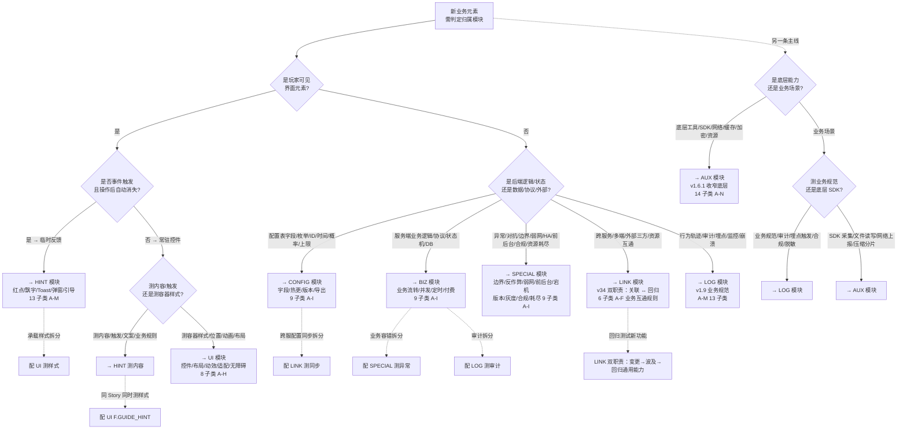

# 模块边界决策树
> **用途**：S2/S5 生成 OBJ/TP 时，**二叉决策**判定该业务元素归属哪个模块。
> **区别**：`knowledge/public/module_templates/<MODULE>/O_boundary.md` 是**叙述型边界规则**（判定三问 + 边界对照表），
> 本文件是**决策树型**（问题→是/否分叉→结论），适合 Agent 快速判定。
>
> **来源**：综合 `.cursor/MODULES.md` §4 各模块边界 + 8 个 O_boundary.md
> **生效日期**：2026-07-14
> **协议**：决策树为本文件 SSoT，O_boundary.md 仍是 SSOT（叙述版），两者保持一致

---

## 0. 顶层决策树（8 模块快速归类）

**使用说明**：

1. 从 Start 进入
2. 每个问题选 `是` 或 `否`（沿边走）
3. 命中模块后，**必须**再跳到该模块的"判定三问"二次验证（避免顶层误判）
4. 命中 2 个模块交集（如 HINT+UI / BIZ+LINK）→ **拆多 OBJ**（按 v12 S2 跨模块规则）

---

## 1. 模块判定三问（8 模块索引）

每个模块的"判定三问"详细规则见 `O_boundary.md`。本节为索引（避免重复维护）。

| 模块 | 核心定义 | 判定三问入口 | O_boundary 路径 |
|---|---|---|---|
| **UI** | 页面常驻控件 + 样式/位置/动画 + 布局适配 + 多端 UI 渲染（PC/移动/模拟器）+ 静态资源展示 + 前端纯本地交互（无后端调用） | 1. 是否调用后端接口 / 改变后端数据 / 依赖外部系统？ → 任一是 → 不归 UI（归 BIZ/LINK）；2. 是否事件触发弹出 + 操作后自动消失？ → 是 → 归 HINT 而非 UI；3. 纯前端 UI 容器（样式/位置/动画/布局/适配）？ → 是 → UI（A 控件基础 / B 纯交互 / C 布局 / D 静态展示 / E 动效 / F 引导样式 / G 无障碍 / H 异常页面 UI） | `module_templates/UI/I_boundary.md` |
| **HINT** | 玩家可见的全局临时反馈类提示组件（红点 / 飘字 / Toast / 模态弹窗 / 浮动浮窗 / 引导气泡 / 合规预警 / 离线补偿弹窗） | 1. 事件触发弹出 + 一次性反馈 + 操作后自动消失？ → 是 → 归 HINT（A 红点 / B 资源飘字 / C 战斗飘字 / D 模态弹窗 / E Toast / F 浮窗 / G 限时提醒+错误文案 / H 新手引导 / I 社交提示 / J 运营推送 / K 状态变更 / L 风控合规 / M 离线补偿）；2. 页面常驻控件 / 固定布局 / 静态展示？ → 是 → 不归 HINT（归 UI）；3. 测"显示什么内容/数字/文案"（HINT）还是测"UI 容器样式/位置/动画"（UI F.GUIDE_HINT）？ → 内容 → HINT；样式 → UI | `module_templates/HINT/O_boundary.md` |
| **CONFIG** | 配置文件本身 + 导出/解析/热更/版本兼容 + 表与表之间数值/ID 约束 + 静态数值规则校验（字段/枚举/资源/ID/时间/概率/上限/平衡） | 1. 是"配置本身"（字段/枚举/资源/ID/时间）还是"运行时行为"？ → 运行时 → 不归 CONFIG；2. 是"静态数值规则"还是"业务逻辑计算"？ → 业务 → 不归 CONFIG；3. 是"导出/解析"还是"业务接口调用"？ → 业务 → 不归 CONFIG（按子类 A 字段合法性 / B 同表一致性 / C 跨表依赖 / D 热更 / E 解析 / F 版本兼容 / G 数值逻辑 / H 导出发布 / I 服务端专属 选） | `module_templates/CONFIG/J_boundary.md` |
| **BIZ** | 服务端业务逻辑 + 协议 + 数据流 + 状态机 + DB + 并发 + 定时 + 付费 + 审计（单系统独立业务流转） | 1. 是"服务端业务逻辑"还是"通用工具/UI/配置"？ → 后者 → 不归 BIZ；2. 是"正常业务流程"还是"异常行为（弱网/反作弊/切后台）"？ → 异常 → 不归 BIZ（归 SPECIAL）；3. 是"业务日志"还是"通用行为日志"？ → 通用 → 不归 BIZ（归 LOG / AUX）（按子类 A 核心逻辑 / B 数据流 / C 协议 / D 状态机 / E DB / F 并发 / G 定时 / H 付费 / I 审计日志 选） | `module_templates/BIZ/O_boundary.md` |
| **SPECIAL** | 异常 + 高危 + 对抗 + 极限 + 合规 + 资源耗尽 类业务风控与容错逻辑（边界极端 / 反作弊 / 弱网限流 / 前后台 / 宕机高危 / 版本兼容 / 渠道灰度 / 合规 / 资源耗尽） | 1. 是底层能力/工具/SDK？ → 归 AUX（先排除）；2. 是单系统独立业务流程？ → 归 BIZ（再排除）；3. 是多系统/多端/外部互通？ → 归 LINK（再排除）；4. 是异常/高危/对抗/极限/合规/资源耗尽？ → 归 SPECIAL（A 边界 / B 反作弊 / C 弱网限流 / D 前后台 / E 宕机高危 / F 版本兼容 / G 渠道灰度 / H 合规 / I 资源耗尽） | `module_templates/SPECIAL/O_boundary.md` |
| **AUX** | 底层通用基础能力 + 工具 + 框架组件（v1.6.1 收窄——不含日志/埋点/崩溃 SDK / 提示 API / 第三方 SDK / 风控 / 业务异常，已迁出到 LOG/HINT/LINK/SPECIAL/BIZ） | 1. 是"通用工具/框架底层"还是"业务逻辑"？ → 业务 → 不归 AUX（归 BIZ）；2. 是"底层能力"还是"上层功能/业务辅助"？ → 上层 → 不归 AUX；3. 是"通用技术底层"还是"业务场景"？ → 业务 → 不归 AUX（按子类 A 公共工具 / B 网络 / C 缓存 / D 资源 / E 汇率 / F 离线更新 / G GM / H 测试脚本 / I 验收清单 / J 存储 / K 性能 / L 运营 / M 加密 / N 异常兜底 选） | `module_templates/AUX/O_boundary.md` |
| **LINK** | 功能 ↔ 功能结构关系（跳转/从属/传递/触发链）+ 跨服务/跨端/外部三方/资源互通的业务互通规则与数据同步一致性校验 + 新增功能对已有通用能力的回归验证 | 1. 是底层能力/工具/SDK/网络传输？ → AUX 排除；2. 是单系统独立业务流程？ → BIZ 排除；3. 涉及多系统/多服务/多端/外部互通 + 业务规则？ → LINK（A 内部关联 / B 跨服务 / C 多端 / D 外部 / E 资源互通 / F 对外透出） | `module_templates/LINK/O_boundary.md` |
| **LOG** | 日志业务规范 + 审计 + 埋点触发 + 合规（v1.9 严格隔离——LOG 管业务规范，AUX 管底层 SDK/采集/上报框架，无职责重叠） | 1. 测"业务侧应该写什么日志、写什么字段、字段怎么脱敏、链路怎么串联"？ → 是 → LOG；2. 测"S SDK 怎么采集、文件怎么写、网络怎么传"？ → 是 → 不归 LOG（归 AUX B/J/K/M/N）；3. 是"业务埋点触发规则"还是"日志技术实现"？ → 技术 → 不归 LOG（按子类 A 行为埋点 / B 资产审计 / C 操作日志 / D 服务监控 / E 崩溃 / F 分级存储 / G 完整性 / H 字段合规 / I 全链路 trace / J 安全反作弊 / K 第三方 / L 多环境 / M 上报容错 选） | `module_templates/LOG/O_boundary.md` |

---

## 2. 跨模块拆分规则（命中多模块时）

按 v12 S2 跨模块规则：**一条业务涉及多模块时，按模块拆多 OBJ（不标 [待确认]）**。

| 场景 | 拆分方式 | 示例 |
|---|---|---|
| HINT + UI | 拆 HINT（内容/触发/文案）+ UI（容器样式/位置/动画）| 购买成功 Toast：HINT E.TOAST（"购买成功"内容）+ UI F.GUIDE_HINT（Toast 容器动画）|
| BIZ + LINK | 拆 BIZ（业务）+ LINK（跨服同步）| 跨服交易：BIZ A（扣款发货）+ LINK B（跨服数据同步）|
| BIZ + LOG | 拆 BIZ（业务）+ LOG（审计/埋点/对账）| 资产变更：BIZ E（产出/消耗）+ LOG B（资产审计埋点）|
| SPECIAL + BIZ | 拆 SPECIAL（异常/对抗/容错）+ BIZ（正常路径）| 弱网购买：SPECIAL C（弱网重试/不重复扣款）+ BIZ A（正常购买流程）|
| UI + HINT | 拆 UI（容器）+ HINT（内容）| 暴击飘字：UI E.ANIMATION（飘字颜色/放大动画）+ HINT C.CURRENCY_FLOAT（"+9999 暴击"内容）|
| AUX + LINK | 拆 AUX（底层 SDK/缓存工具）+ LINK（业务同步/互通规则）| 本地缓存差值刷新：AUX C（本地缓存 LRU 实现）+ LINK C（差值刷新业务规则/兜底校正）|
| BIZ + SPECIAL | 拆 BIZ（正常业务）+ SPECIAL（异常拦截/边界）| 商城限购：BIZ A（限购业务规则）+ SPECIAL A（边界极端——超限购次数拦截）|
| CONFIG + LINK | 拆 CONFIG（配置字段/版本兼容）+ LINK（跨服/外部同步业务）| 灰度白名单配置：CONFIG F（白名单配置字段/版本兼容）+ LINK B（跨服白名单同步业务规则）|

**拆多 OBJ 后**：每个 OBJ 各自生成 TP（不在同一 OBJ 内混合模块）。

---

## 3. 决策树 vs O_boundary.md 同步原则

| 改动 | 同步动作 |
|---|---|
| 改本文件（决策树） | **必须**同步改对应 O_boundary.md 的"判定三问"（决策树是简化版,三问是完整版） |
| 改 O_boundary.md 判定三问 | **建议**同步改本文件（决策树分支可能需要调整） |
| 改 MODULES.md §4 边界表 | **必须**同步改本文件 + 对应 O_boundary.md |
| 新增模块 | **必须**在 3 处全部新增（决策树顶层 + 判定三问表 + O_boundary.md） |

---

## 4. v14 第一阶段落地说明

- **落地方式**：本决策树嵌入 S2/S5 SKILL.md 的"必读材料"节
- **Agent 使用**：S2/S5 生成时,先用决策树命中模块,再读对应 O_boundary.md 的判定三问二次验证
- **预期收益**：模块归类错误率 -50%（v14 §六 验收指标）