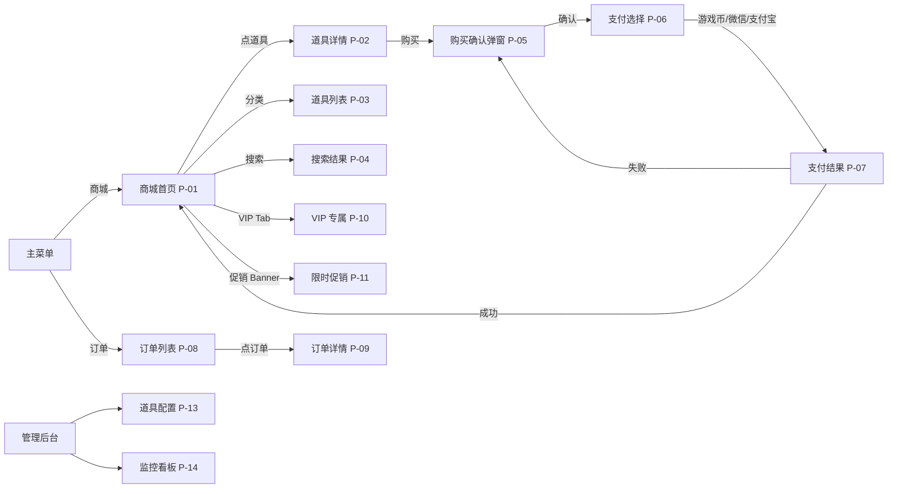

# S3 原型导出 — 游戏道具商城系统 v1.0

> 重跑于 2026-06-15（/aidocx-workflow-conversation 全量流水线）

## 页面清单（14 个页面）

| 页面 ID | 名称 | 模块 | 入口 |
|---|---|---|---|
| P-01 | 商城首页 | UI | 主菜单「商城」 |
| P-02 | 道具详情页 | UI | 首页点击道具 |
| P-03 | 道具列表（分类） | UI | 首页分类导航 |
| P-04 | 搜索结果页 | UI | 首页搜索框 |
| P-05 | 购买确认弹窗 | HINT | 详情页「购买」按钮 |
| P-06 | 支付选择页 | UI | 弹窗「确认」 |
| P-07 | 支付结果页 | HINT | 支付完成 |
| P-08 | 订单列表 | UI | 主菜单「订单」 |
| P-09 | 订单详情 | UI | 订单列表点击 |
| P-10 | VIP 专属商城 | UI | 首页顶部 Tab |
| P-11 | 限时促销页 | UI | 首页 Banner |
| P-12 | 新手礼包 | HINT | 首次登录引导 |
| P-13 | 管理后台-道具配置 | CONFIG | /admin/items |
| P-14 | 监控看板 | LOG | /admin/monitor |

## 页面流图



## 关键页面元素

### P-01 商城首页

```
┌─────────────────────────────────┐
│ [≡] 商城          [🔍]  [👤]  │
├─────────────────────────────────┤
│ ┌─────────────────────────────┐ │
│ │  🎉 限时促销 Banner          │ │
│ └─────────────────────────────┘ │
│                                 │
│  [武器][时装][坐骑][消耗品][礼包]│
│                                 │
│  热门推荐（前 10）              │
│  ┌────┐┌────┐┌────┐┌────┐┌────┐│
│  │屠龙││时装││坐骑││血瓶││礼包││
│  │100 ││80  ││200 ││10  ││50  ││
│  └────┘└────┘└────┘└────┘└────┘│
│  ┌────┐┌────┐┌────┐┌────┐┌────┐│
│  │ ...││ ...││ ...││ ...││ ...││
│  └────┘└────┘└────┘└────┘└────┘│
│         ◀ 1/10 ▶                │
└─────────────────────────────────┘
```

### P-02 道具详情页

```
┌─────────────────────────────────┐
│ [←] 道具详情                     │
├─────────────────────────────────┤
│       [3D 道具模型]              │
│       屠龙刀                     │
│  ─────────────────────────────  │
│  描述：传说中的神兵...           │
│  属性：攻击 +999                 │
│  价格：500 游戏币 [VIP 9 折]     │
│  ─────────────────────────────  │
│  数量: [-] 1 [+]  (1-99)         │
│  ─────────────────────────────  │
│  [   购买   ]                    │
│  余额：1000 游戏币               │
└─────────────────────────────────┘
```

### P-05 购买确认弹窗（HINT）

```
        ┌─────────────────┐
        │  确认购买        │
        ├─────────────────┤
        │  屠龙刀 × 1     │
        │  总价：500 币   │
        │  余额：1000 币  │
        │                 │
        │  [取消]  [确认] │
        └─────────────────┘
```

### P-13 管理后台-道具配置（CONFIG）

```
┌─────────────────────────────────┐
│ 管理 / 道具配置                  │
├─────────────────────────────────┤
│ [+ 新增]  [批量导入]  [导出]    │
│ ┌────┬──────┬─────┬────┬────┐  │
│ │ ID │ 名称 │ 类型│价格│状态│  │
│ ├────┼──────┼─────┼────┼────┤  │
│ │ 1  │屠龙刀│武器 │500 │上架│  │
│ │ 2  │血瓶  │消耗│10  │上架│  │
│ │ ... │ ...  │ ... │ ...│ ...│  │
│ └────┴──────┴─────┴────┴────┘  │
│  [保存]  [发布]  [灰度 5%]    │
└─────────────────────────────────┘
```