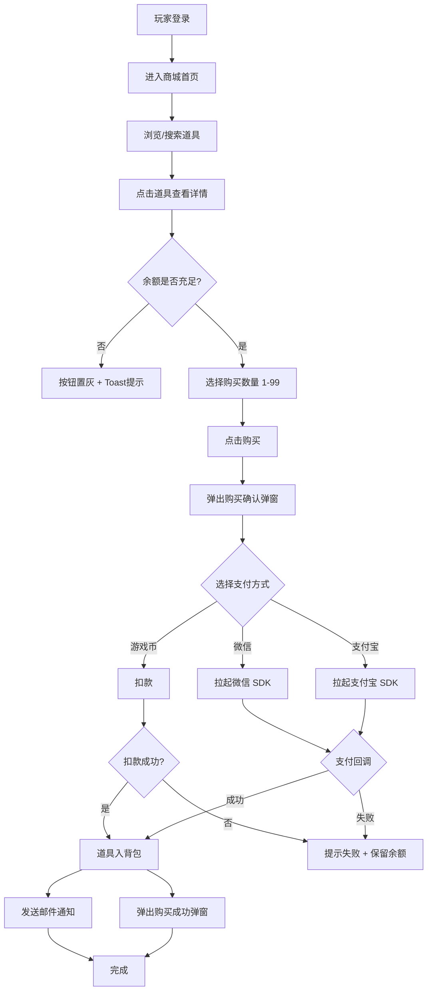
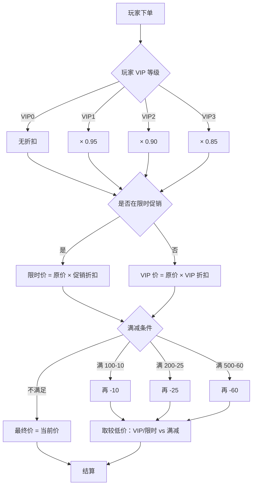
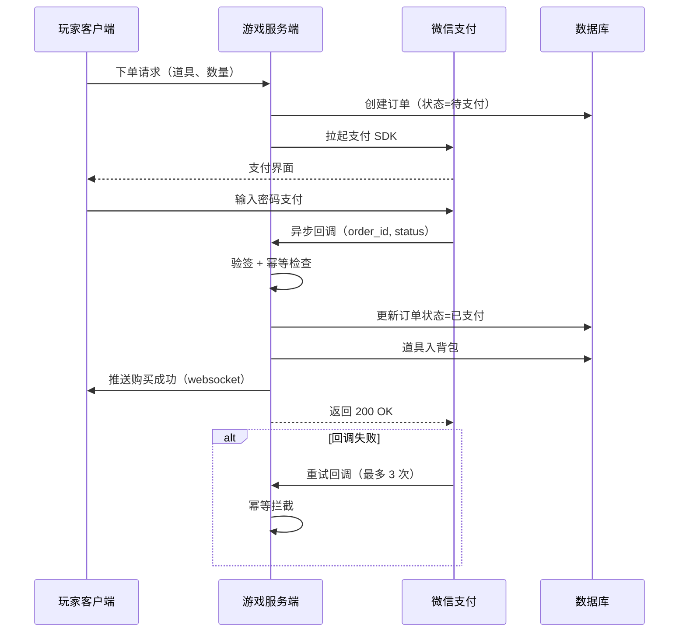
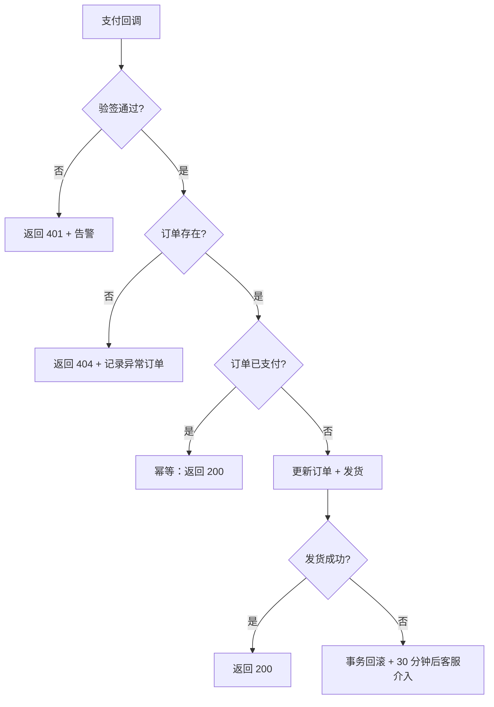
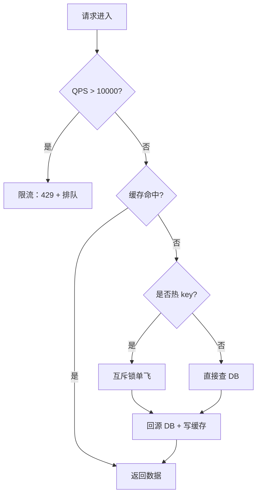

# S4 业务流程图导出 — 游戏道具商城系统 v1.0

> 重跑于 2026-06-15（/aidocx-workflow-conversation 全量流水线）

## 1. 核心业务流程图

### 1.1 购买流程（主路径）

### 1.2 VIP 折扣与促销叠加流程

## 2. 时序图

### 2.1 微信支付时序

## 3. 异常决策树

### 3.1 支付回调异常

### 3.2 高并发异常决策

## 4. 风险点清单

| 风险 ID | 描述 | 等级 | 涉及模块 |
|---|---|---|---|
| R-N01 | 支付回调延迟/失败 | HIGH | BIZ/LINK |
| R-N02 | 10000 并发压垮 DB | HIGH | BIZ/AUX/SPECIAL |
| R-N03 | 金额篡改攻击 | HIGH | BIZ/SPECIAL |
| R-N04 | 重复下单 | MEDIUM | BIZ/SPECIAL |
| R-N05 | 缓存击穿 | MEDIUM | AUX |
| R-N06 | 弱网重试 | MEDIUM | BIZ/SPECIAL/LINK |
| R-N07 | VIP 折扣叠加争议 | LOW | BIZ |
| R-N08 | 邮件服务宕机 | LOW | HINT |
| R-N09 | 监控平台 5xx | LOW | LOG |
| R-N10 | 灰度环境不一致 | LOW | BIZ/SPECIAL |