# 游戏道具商城系统 — 业务流程图

**Version**: v1.0
**Date**: 2026-06-15
**Source**: S2 Backlog (11 Epics, 27 Stories)
**S3 Prototype**: 未执行（无）
**上游 S1.5 质量评价**: HIGH | P0 填写 7/7

> ⚠️ **v1.1+ 重构**：补全 4 类可机检 ID（`R-NNN` / `R-{EpicID}-NN` / `S4-{EpicID}-X.Y.Z` / `S4-{EpicID}-FNN`），
> 风险点 ↔ 异常树叶子交叉引用 ≥ 50%，S7 100% 覆盖率审计的 SSoT。

---

## 0. 元信息

| Epic ID | 模块（8模块） | 名称 | Story 数 | 风险点数 | 异常树叶子节点数 |
|---------|--------------|------|----------|---------|-----------------|
| BIZ-PURCHASE | BIZ | 购买流程 | 5 | 5 | 11 |
| CONFIG-VIP | CONFIG | VIP体系 | 3 | 3 | 7 |
| CONFIG-DISCOUNT | CONFIG | 促销配置 | 3 | 3 | 9 |
| UI-SHOP | UI | 商城首页 | 3 | 3 | 7 |
| UI-DETAIL | UI | 道具详情页 | 2 | 2 | 5 |
| BIZ-ORDER | BIZ | 订单管理 | 2 | 1 | 3 |
| AUX-CACHE | AUX | 道具数据缓存 | 1 | 2 | 3 |
| AUX-EXRATE | AUX | 汇率配置 | 1 | 1 | 3 |
| LINK-PAYMENT | LINK | 支付接口 | 1 | 3 | 7 |
| LOG-PAYMENT | LOG | 支付日志 | 1 | 2 | 3 |
| SPECIAL-VIP-CHANGE | SPECIAL | VIP等级变更 | 2 | 1 | 5 |
| **合计** | | | **24** | **27** | **63** |

---

## 1. BIZ-PURCHASE — 购买流程

### 1.1 主业务流程（Flowchart）

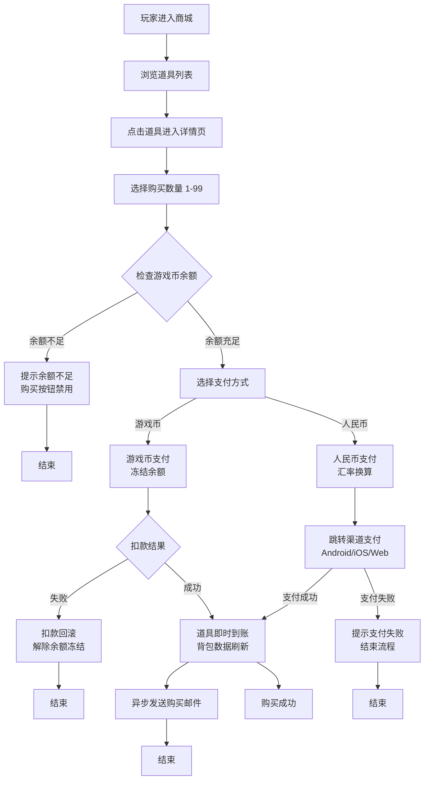
```mermaid
flowchart TD
    S4-BIZ-PURCHASE-F01["玩家进入商城"] --> S4-BIZ-PURCHASE-F02["浏览道具列表"]
    S4-BIZ-PURCHASE-F02 --> S4-BIZ-PURCHASE-F03["点击道具进入详情页"]
    S4-BIZ-PURCHASE-F03 --> S4-BIZ-PURCHASE-F04["选择购买数量 1-99"]
    S4-BIZ-PURCHASE-F04 --> S4-BIZ-PURCHASE-F05{"检查游戏币余额"}
    S4-BIZ-PURCHASE-F05 -->|"余额充足"| S4-BIZ-PURCHASE-F06["选择支付方式"]
    S4-BIZ-PURCHASE-F05 -->|"余额不足"| S4-BIZ-PURCHASE-F07["提示余额不足\n购买按钮禁用"]
    S4-BIZ-PURCHASE-F07 --> S4-BIZ-PURCHASE-END1["结束"]
    S4-BIZ-PURCHASE-F06 -->|"游戏币"| S4-BIZ-PURCHASE-F08["游戏币支付\n冻结余额"]
    S4-BIZ-PURCHASE-F06 -->|"人民币"| S4-BIZ-PURCHASE-F09["人民币支付\n汇率换算"]
    S4-BIZ-PURCHASE-F08 --> S4-BIZ-PURCHASE-F10{"扣款结果"}
    S4-BIZ-PURCHASE-F10 -->|"成功"| S4-BIZ-PURCHASE-F11["道具即时到账\n背包数据刷新"]
    S4-BIZ-PURCHASE-F10 -->|"失败"| S4-BIZ-PURCHASE-F12["扣款回滚\n解除余额冻结"]
    S4-BIZ-PURCHASE-F12 --> S4-BIZ-PURCHASE-END2["结束"]
    S4-BIZ-PURCHASE-F11 --> S4-BIZ-PURCHASE-F13["异步发送购买邮件"]
    S4-BIZ-PURCHASE-F11 --> S4-BIZ-PURCHASE-END3["购买成功"]
    S4-BIZ-PURCHASE-F13 --> S4-BIZ-PURCHASE-END4["结束"]
    S4-BIZ-PURCHASE-F09 --> S4-BIZ-PURCHASE-F14["跳转渠道支付\nAndroid/iOS/Web"]
    S4-BIZ-PURCHASE-F14 -->|"支付成功"| S4-BIZ-PURCHASE-F11
    S4-BIZ-PURCHASE-F14 -->|"支付失败"| S4-BIZ-PURCHASE-F15["提示支付失败\n结束流程"]
    S4-BIZ-PURCHASE-F15 --> S4-BIZ-PURCHASE-END5["结束"]
```

### 1.2 时序图（Sequence）

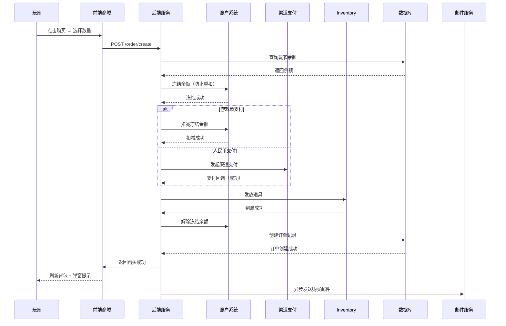
```mermaid
sequenceDiagram
    participant P as 玩家
    participant UI as 前端商城
    participant SV as 后端服务
    participant ACC as 账户系统
    participant PAY as 渠道支付
    participant INV as Inventory
    participant DB as 数据库
    participant MAIL as 邮件服务

    P->>UI: 点击购买 → 选择数量
    UI->>SV: POST /order/create
    SV->>DB: 查询玩家余额
    DB-->>SV: 返回余额
    SV->>ACC: 冻结余额（防止重扣）
    ACC-->>SV: 冻结成功
    alt 游戏币支付
        SV->>ACC: 扣减冻结金额
        ACC-->>SV: 扣减成功
    else 人民币支付
        SV->>PAY: 发起渠道支付
        PAY-->>SV: 支付回调（成功）
    end
    SV->>INV: 发放道具
    INV-->>SV: 到账成功
    SV->>ACC: 解除冻结余额
    SV->>DB: 创建订单记录
    DB-->>SV: 订单创建成功
    SV-->>UI: 返回购买成功
    UI-->>P: 刷新背包 + 弹窗提示
    SV->>MAIL: 异步发送购买邮件
```

### 1.3 异常/错误决策树

```
S4-BIZ-PURCHASE-1.0  购买流程异常决策树
│
├── S4-BIZ-PURCHASE-1.1  余额不足
│   └── S4-BIZ-PURCHASE-1.1.1  购买按钮禁用 → 前端拦截，不发起请求
│
├── S4-BIZ-PURCHASE-1.2  数量超限（>99 或 <1）
│   └── S4-BIZ-PURCHASE-1.2.1  前端拦截 → 提示「数量超出范围」
│
├── S4-BIZ-PURCHASE-1.3  游戏币支付失败
│   ├── S4-BIZ-PURCHASE-1.3.1  账户系统异常 → 解冻余额 → 返回错误码 → 提示重试
│   ├── S4-BIZ-PURCHASE-1.3.2  余额在并发请求中不足（竞态）→ 余额冻结机制防重扣 → 拒绝并退款冻结额
│   └── S4-BIZ-PURCHASE-1.3.3  扣款后到账失败（道具服务异常）→ 原路回滚 → 解冻余额 → 记录错误日志
│
├── S4-BIZ-PURCHASE-1.4  人民币支付失败
│   ├── S4-BIZ-PURCHASE-1.4.1  渠道支付超时（>30s）→ 查询渠道状态 → 确认失败 → 解冻余额
│   ├── S4-BIZ-PURCHASE-1.4.2  渠道回调异常 → 幂等性处理（订单号唯一）→ 重复回调防处理
│   └── S4-BIZ-PURCHASE-1.4.3  汇率获取失败 → 返回「汇率加载中」→ 禁用人民币支付
│
├── S4-BIZ-PURCHASE-1.5  道具到账失败（道具ID不存在/背包满）
│   ├── S4-BIZ-PURCHASE-1.5.1  道具ID无效 → 退款游戏币 → 标记订单失败 → 发邮件通知
│   └── S4-BIZ-PURCHASE-1.5.2  背包满 → 道具发送到仓库 → 仍标记成功 → 发邮件说明
│
└── S4-BIZ-PURCHASE-1.6  邮件发送失败
    └── S4-BIZ-PURCHASE-1.6.1  异步重试（最多3次）→ 失败后记录DB → 人工补偿
```

### 1.4 风险点

| 风险 ID（机器友好） | 风险 ID（人类可读） | 风险类型（7类） | 风险描述 | s4_reference | 异常树叶子 | 解决方案 |
|--------------------|--------------------|-----------------|----------|--------------|-----------|----------|
| R-001 | R-BIZ-PURCHASE-01 | 竞态条件 | 同一玩家并发发起两次购买，余额冻结前第二个请求也通过校验 | R-001 | S4-BIZ-PURCHASE-1.3.2 | 先冻结再校验 |
| R-002 | R-BIZ-PURCHASE-02 | 支付幂等性 | 渠道回调重复推送 | R-002 | S4-BIZ-PURCHASE-1.4.2 | 订单号唯一约束 + 已处理回调记录 |
| R-003 | R-BIZ-PURCHASE-03 | 时间依赖 | 汇率在支付过程中变更 | R-003 | S4-BIZ-PURCHASE-1.4.3 | 订单创建时锁定汇率，后续变动不影响 |
| R-004 | R-BIZ-PURCHASE-04 | 数据一致性 | 扣款成功但到账失败 | R-004 | S4-BIZ-PURCHASE-1.3.3 / S4-BIZ-PURCHASE-1.5.1 | 事务内操作，失败全量回滚 |
| R-005 | R-BIZ-PURCHASE-05 | 资源/容量 | 邮件异步失败（容量满 / 重试耗尽） | R-005 | S4-BIZ-PURCHASE-1.6.1 | DB记录+重试机制，最多3次 |

---

## 2. CONFIG-VIP — VIP体系

### 2.1 主业务流程（Flowchart）

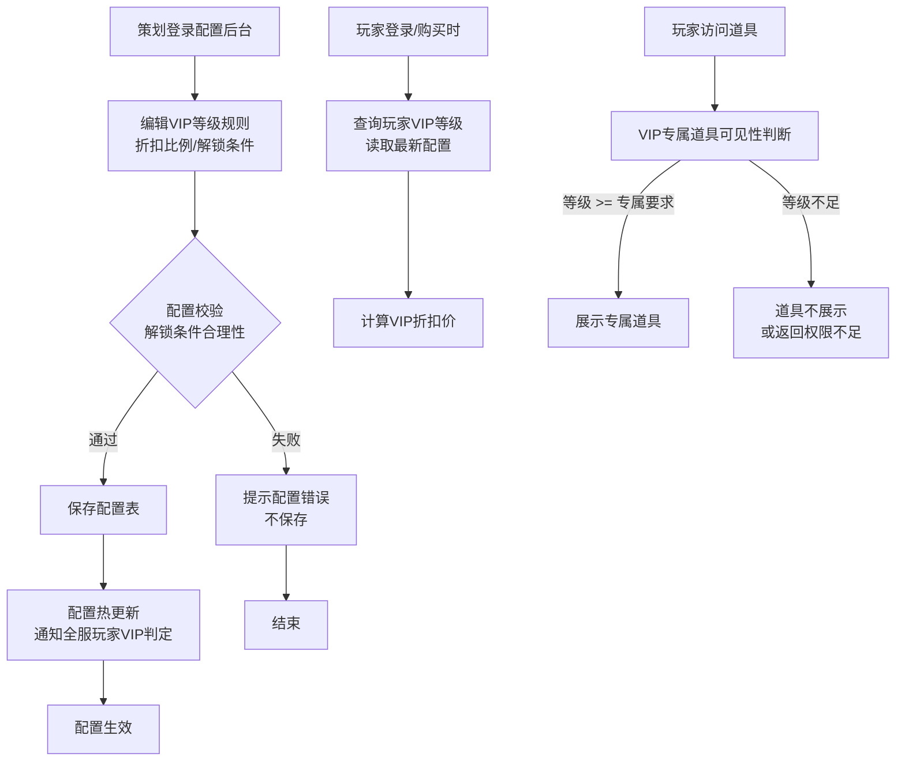
```mermaid
flowchart TD
    S4-CONFIG-VIP-F01["策划登录配置后台"] --> S4-CONFIG-VIP-F02["编辑VIP等级规则\n折扣比例/解锁条件"]
    S4-CONFIG-VIP-F02 --> S4-CONFIG-VIP-F03{"配置校验\n解锁条件合理性"}
    S4-CONFIG-VIP-F03 -->|"通过"| S4-CONFIG-VIP-F04["保存配置表"]
    S4-CONFIG-VIP-F03 -->|"失败"| S4-CONFIG-VIP-F05["提示配置错误\n不保存"]
    S4-CONFIG-VIP-F04 --> S4-CONFIG-VIP-F06["配置热更新\n通知全服玩家VIP判定"]
    S4-CONFIG-VIP-F05 --> S4-CONFIG-VIP-END1["结束"]
    S4-CONFIG-VIP-F06 --> S4-CONFIG-VIP-END2["配置生效"]
    S4-CONFIG-VIP-F07["玩家登录/购买时"] --> S4-CONFIG-VIP-F08["查询玩家VIP等级\n读取最新配置"]
    S4-CONFIG-VIP-F08 --> S4-CONFIG-VIP-F09["计算VIP折扣价"]
    S4-CONFIG-VIP-F10["玩家访问道具"] --> S4-CONFIG-VIP-F11["VIP专属道具可见性判断"]
    S4-CONFIG-VIP-F11 -->|"等级 >= 专属要求"| S4-CONFIG-VIP-F12["展示专属道具"]
    S4-CONFIG-VIP-F11 -->|"等级不足"| S4-CONFIG-VIP-F13["道具不展示\n或返回权限不足"]
```

### 2.2 时序图（Sequence）

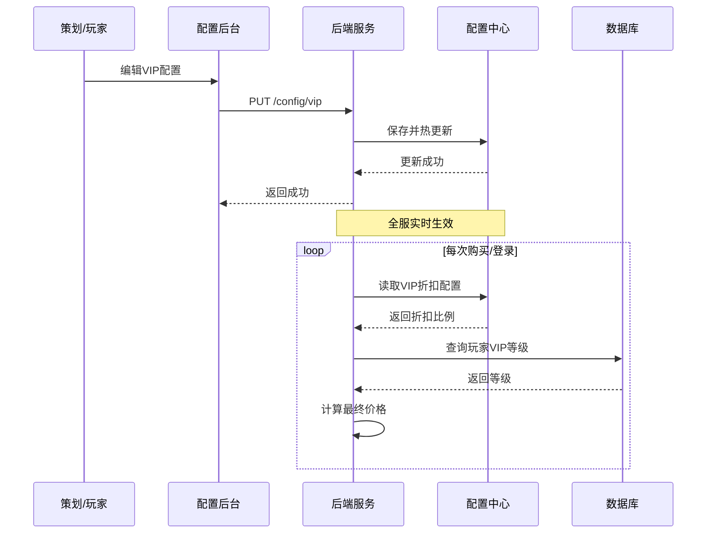
```mermaid
sequenceDiagram
    participant P as 策划/玩家
    participant ADMIN as 配置后台
    participant SV as 后端服务
    participant CONFIG as 配置中心
    participant DB as 数据库

    P->>ADMIN: 编辑VIP配置
    ADMIN->>SV: PUT /config/vip
    SV->>CONFIG: 保存并热更新
    CONFIG-->>SV: 更新成功
    SV-->>ADMIN: 返回成功
    Note over SV,CONFIG: 全服实时生效
    loop 每次购买/登录
        SV->>CONFIG: 读取VIP折扣配置
        CONFIG-->>SV: 返回折扣比例
        SV->>DB: 查询玩家VIP等级
        DB-->>SV: 返回等级
        SV->>SV: 计算最终价格
    end
```

### 2.3 异常/错误决策树

```
S4-CONFIG-VIP-1.0  VIP配置异常决策树
│
├── S4-CONFIG-VIP-1.1  策划保存VIP配置失败
│   ├── S4-CONFIG-VIP-1.1.1  折扣比例超限（>1 或 <0）→ 前端拦截 → 提示「折扣比例需在0-100%之间」
│   ├── S4-CONFIG-VIP-1.1.2  解锁条件冲突 → 后端校验 → 拒绝保存 → 提示冲突条件
│   └── S4-CONFIG-VIP-1.1.3  配置中心连接失败 → 返回错误 → 策划重试
│
├── S4-CONFIG-VIP-1.2  VIP折扣计算异常
│   ├── S4-CONFIG-VIP-1.2.1  玩家无VIP等级（灰度用户）→ 按无折扣计价
│   └── S4-CONFIG-VIP-1.2.2  折扣比例配置为空 → 视为无VIP折扣
│
└── S4-CONFIG-VIP-1.3  VIP专属道具可见性异常
    ├── S4-CONFIG-VIP-1.3.1  玩家尝试通过URL直接访问 → 后端鉴权 → 权限不足 → 返回403
    └── S4-CONFIG-VIP-1.3.2  VIP等级刚变更（配置热更新瞬间）→ 读最新配置 → 实时生效判定
```

### 2.4 风险点

| 风险 ID（机器友好） | 风险 ID（人类可读） | 风险类型（7类） | 风险描述 | s4_reference | 异常树叶子 | 解决方案 |
|--------------------|--------------------|-----------------|----------|--------------|-----------|----------|
| R-006 | R-CONFIG-VIP-01 | 状态损坏 | 配置热更新与购买流程交叉，已有购买流程进行中 | R-006 | S4-CONFIG-VIP-1.3.2 | 以配置变更时间点为分界，新订单用新配置 |
| R-007 | R-CONFIG-VIP-02 | 时间依赖 | VIP等级读取延迟：DB更新后缓存未失效 | R-007 | S4-CONFIG-VIP-1.2.1 | 配置中心推送 + 缓存失效TTL ≤ 5s |
| R-008 | R-CONFIG-VIP-03 | 业务规则 | 折扣叠加二义性：VIP折扣与限时折扣叠加规则由CONFIG-DISCOUNT-005定义 | R-008 | S4-CONFIG-VIP-1.1.2 | 此处不叠加，配置表优先级字段决定 |

---

## 3. CONFIG-DISCOUNT — 促销配置

### 3.1 主业务流程（Flowchart）

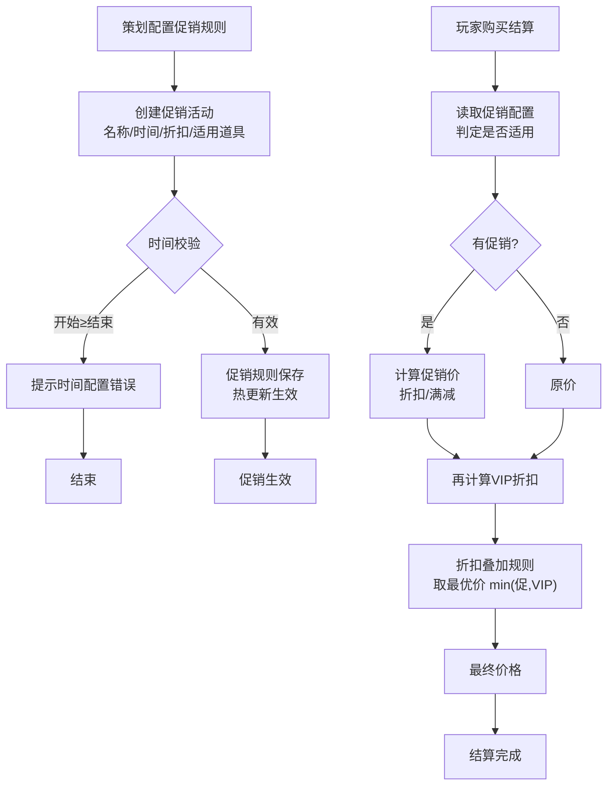
```mermaid
flowchart TD
    S4-CONFIG-DISCOUNT-F01["策划配置促销规则"] --> S4-CONFIG-DISCOUNT-F02["创建促销活动\n名称/时间/折扣/适用道具"]
    S4-CONFIG-DISCOUNT-F02 --> S4-CONFIG-DISCOUNT-F03{"时间校验"}
    S4-CONFIG-DISCOUNT-F03 -->|"开始≥结束"| S4-CONFIG-DISCOUNT-F04["提示时间配置错误"]
    S4-CONFIG-DISCOUNT-F04 --> S4-CONFIG-DISCOUNT-END1["结束"]
    S4-CONFIG-DISCOUNT-F03 -->|"有效"| S4-CONFIG-DISCOUNT-F05["促销规则保存\n热更新生效"]
    S4-CONFIG-DISCOUNT-F05 --> S4-CONFIG-DISCOUNT-END2["促销生效"]
    S4-CONFIG-DISCOUNT-F06["玩家购买结算"] --> S4-CONFIG-DISCOUNT-F07["读取促销配置\n判定是否适用"]
    S4-CONFIG-DISCOUNT-F07 --> S4-CONFIG-DISCOUNT-F08{"有促销?"}
    S4-CONFIG-DISCOUNT-F08 -->|"是"| S4-CONFIG-DISCOUNT-F09["计算促销价\n折扣/满减"]
    S4-CONFIG-DISCOUNT-F08 -->|"否"| S4-CONFIG-DISCOUNT-F10["原价"]
    S4-CONFIG-DISCOUNT-F09 --> S4-CONFIG-DISCOUNT-F11["再计算VIP折扣"]
    S4-CONFIG-DISCOUNT-F11 --> S4-CONFIG-DISCOUNT-F12["折扣叠加规则\n取最优价 min(促,VIP)"]
    S4-CONFIG-DISCOUNT-F10 --> S4-CONFIG-DISCOUNT-F11
    S4-CONFIG-DISCOUNT-F12 --> S4-CONFIG-DISCOUNT-F13["最终价格"]
    S4-CONFIG-DISCOUNT-F13 --> S4-CONFIG-DISCOUNT-END3["结算完成"]
```

### 3.2 时序图（Sequence）

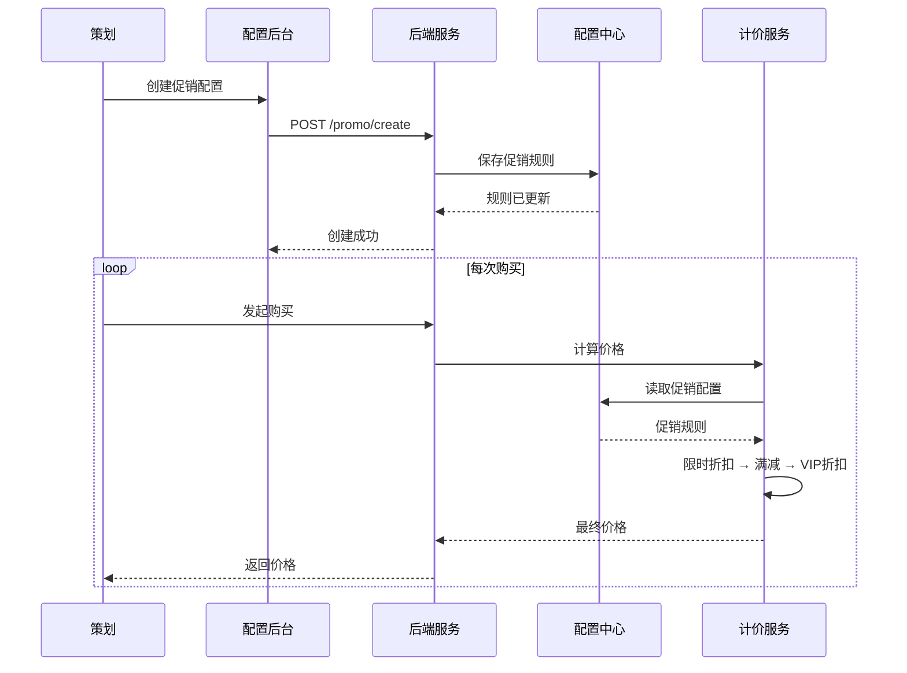
```mermaid
sequenceDiagram
    participant P as 策划
    participant ADMIN as 配置后台
    participant SV as 后端服务
    participant CONFIG as 配置中心
    participant CALC as 计价服务

    P->>ADMIN: 创建促销配置
    ADMIN->>SV: POST /promo/create
    SV->>CONFIG: 保存促销规则
    CONFIG-->>SV: 规则已更新
    SV-->>ADMIN: 创建成功
    loop 每次购买
        P->>SV: 发起购买
        SV->>CALC: 计算价格
        CALC->>CONFIG: 读取促销配置
        CONFIG-->>CALC: 促销规则
        CALC->>CALC: 限时折扣 → 满减 → VIP折扣
        CALC-->>SV: 最终价格
        SV-->>P: 返回价格
    end
```

### 3.3 异常/错误决策树

```
S4-CONFIG-DISCOUNT-1.0  促销配置异常决策树
│
├── S4-CONFIG-DISCOUNT-1.1  促销时间窗口异常
│   ├── S4-CONFIG-DISCOUNT-1.1.1  促销开始时间已过期 → 后端拒绝创建 → 提示「开始时间需晚于当前」
│   ├── S4-CONFIG-DISCOUNT-1.1.2  促销时间与已有促销重叠（同一道具）→ 提示冲突 → 策划调整
│   └── S4-CONFIG-DISCOUNT-1.1.3  促销结束时间超过配置上限 → 提示超出上限 → 策划缩短
│
├── S4-CONFIG-DISCOUNT-1.2  折扣叠加异常
│   ├── S4-CONFIG-DISCOUNT-1.2.1  限时折扣 + VIP折扣同时生效 → 策略1：取最优 min(限时折后价, VIP折后价)
│   ├── S4-CONFIG-DISCOUNT-1.2.2  满减 + 折扣同时生效 → 满减在折扣之后计算
│   └── S4-CONFIG-DISCOUNT-1.2.3  满减超出订单总额 → 满减后价格不低于0
│
└── S4-CONFIG-DISCOUNT-1.3  新手礼包边界
    ├── S4-CONFIG-DISCOUNT-1.3.1  玩家注册时间恰好第7天 → 包含第7天 → 可购买
    ├── S4-CONFIG-DISCOUNT-1.3.2  玩家已购买过新手礼包 → 直接下架 → 不可购买
    └── S4-CONFIG-DISCOUNT-1.3.3  时区差异 → 统一使用UTC时间判定
```

### 3.4 风险点

| 风险 ID（机器友好） | 风险 ID（人类可读） | 风险类型（7类） | 风险描述 | s4_reference | 异常树叶子 | 解决方案 |
|--------------------|--------------------|-----------------|----------|--------------|-----------|----------|
| R-009 | R-CONFIG-DISCOUNT-01 | 时间依赖 | 促销在倒计时最后一秒购买 | R-009 | S4-CONFIG-DISCOUNT-1.1.1 / S4-CONFIG-DISCOUNT-1.3.3 | 以服务器时间戳为准，精确到秒 |
| R-010 | R-CONFIG-DISCOUNT-02 | 安全/合规 | 新手礼包重复购买：玩家通过多设备绕过限制 | R-010 | S4-CONFIG-DISCOUNT-1.3.2 | 订单级唯一约束 + 玩家ID+礼包ID联合索引 |
| R-011 | R-CONFIG-DISCOUNT-03 | 数据一致性 | 满减精度：折扣后金额角分四舍五入 | R-011 | S4-CONFIG-DISCOUNT-1.2.3 | 汇率换算时分四舍五入，满减以分为单位 |

---

## 4. UI-SHOP — 商城首页

### 4.1 主业务流程（Flowchart）

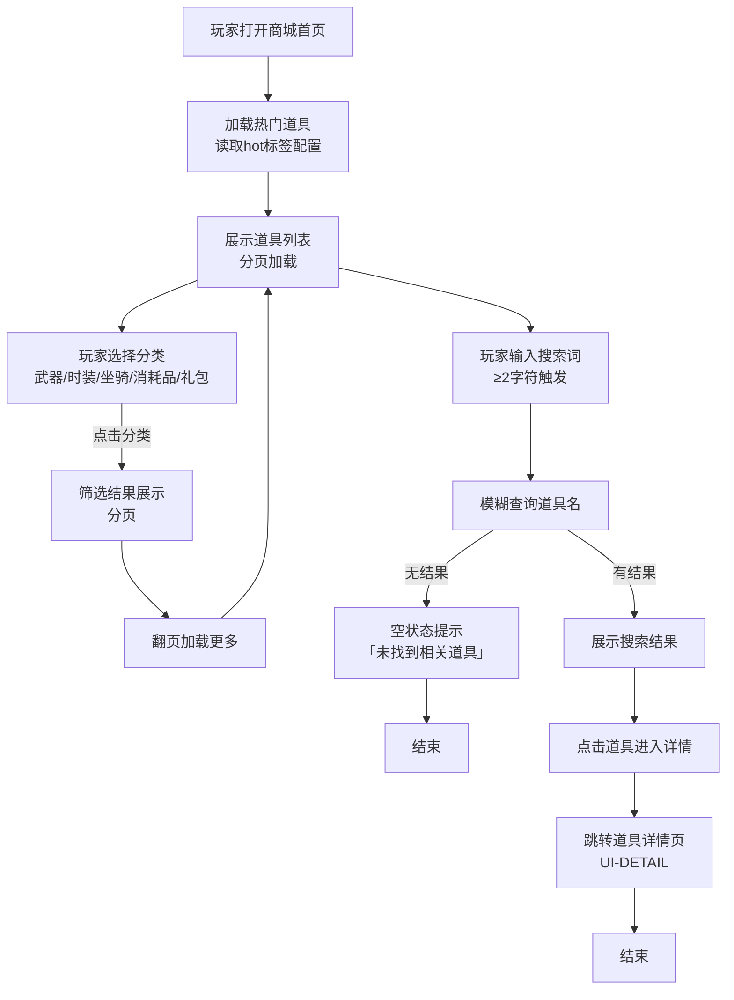
```mermaid
flowchart TD
    S4-UI-SHOP-F01["玩家打开商城首页"] --> S4-UI-SHOP-F02["加载热门道具\n读取hot标签配置"]
    S4-UI-SHOP-F02 --> S4-UI-SHOP-F03["展示道具列表\n分页加载"]
    S4-UI-SHOP-F03 --> S4-UI-SHOP-F04["玩家选择分类\n武器/时装/坐骑/消耗品/礼包"]
    S4-UI-SHOP-F04 -->|"点击分类"| S4-UI-SHOP-F05["筛选结果展示\n分页"]
    S4-UI-SHOP-F05 --> S4-UI-SHOP-F06["翻页加载更多"]
    S4-UI-SHOP-F06 --> S4-UI-SHOP-F03
    S4-UI-SHOP-F03 --> S4-UI-SHOP-F07["玩家输入搜索词\n≥2字符触发"]
    S4-UI-SHOP-F07 --> S4-UI-SHOP-F08["模糊查询道具名"]
    S4-UI-SHOP-F08 -->|"有结果"| S4-UI-SHOP-F09["展示搜索结果"]
    S4-UI-SHOP-F08 -->|"无结果"| S4-UI-SHOP-F10["空状态提示\n「未找到相关道具」"]
    S4-UI-SHOP-F10 --> S4-UI-SHOP-END1["结束"]
    S4-UI-SHOP-F09 --> S4-UI-SHOP-F11["点击道具进入详情"]
    S4-UI-SHOP-F11 --> S4-UI-SHOP-F12["跳转道具详情页\nUI-DETAIL"]
    S4-UI-SHOP-F12 --> S4-UI-SHOP-END2["结束"]
```

### 4.2 时序图（Sequence）

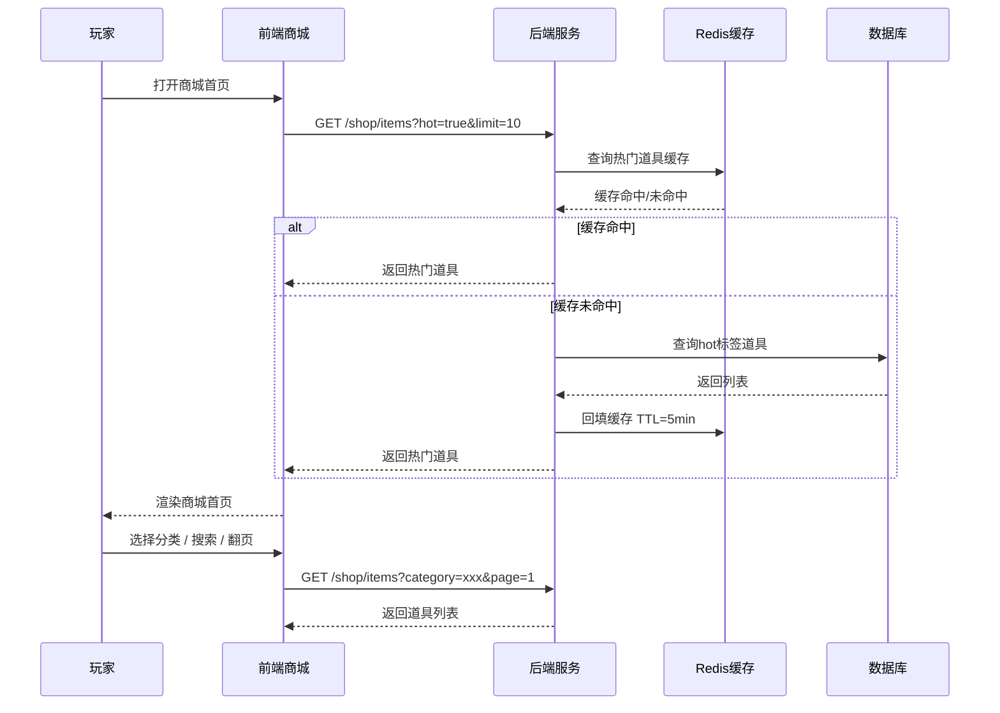
```mermaid
sequenceDiagram
    participant P as 玩家
    participant UI as 前端商城
    participant SV as 后端服务
    participant CACHE as Redis缓存
    participant DB as 数据库

    P->>UI: 打开商城首页
    UI->>SV: GET /shop/items?hot=true&limit=10
    SV->>CACHE: 查询热门道具缓存
    CACHE-->>SV: 缓存命中/未命中
    alt 缓存命中
        SV-->>UI: 返回热门道具
    else 缓存未命中
        SV->>DB: 查询hot标签道具
        DB-->>SV: 返回列表
        SV->>CACHE: 回填缓存 TTL=5min
        SV-->>UI: 返回热门道具
    end
    UI-->>P: 渲染商城首页
    P->>UI: 选择分类 / 搜索 / 翻页
    UI->>SV: GET /shop/items?category=xxx&page=1
    SV-->>UI: 返回道具列表
```

### 4.3 异常/错误决策树

```
S4-UI-SHOP-1.0  商城首页异常决策树
│
├── S4-UI-SHOP-1.1  道具列表加载失败
│   ├── S4-UI-SHOP-1.1.1  网络超时 → 显示骨架屏 → 重试按钮
│   ├── S4-UI-SHOP-1.1.2  数据库查询超时 → 服务降级 → 返回缓存数据 → 提示「数据可能非最新」
│   └── S4-UI-SHOP-1.1.3  分类ID非法 → 返回空列表 → 不报错
│
├── S4-UI-SHOP-1.2  搜索无结果
│   ├── S4-UI-SHOP-1.2.1  关键词长度<2 → 不发起请求 → 前端提示「至少输入2个字符」
│   ├── S4-UI-SHOP-1.2.2  数据库无匹配 → 返回空数组 → 显示空状态
│   └── S4-UI-SHOP-1.2.3  缓存穿透（恶意搜索不存在道具）→ 空结果也缓存TTL=1min → 防止击穿
│
└── S4-UI-SHOP-1.3  热门道具数量<10
    └── S4-UI-SHOP-1.3.1  有多少展示多少 → 不补位填充
```

### 4.4 风险点

| 风险 ID（机器友好） | 风险 ID（人类可读） | 风险类型（7类） | 风险描述 | s4_reference | 异常树叶子 | 解决方案 |
|--------------------|--------------------|-----------------|----------|--------------|-----------|----------|
| R-012 | R-UI-SHOP-01 | 资源/容量 | 缓存雪崩：大量缓存同时失效 | R-012 | S4-UI-SHOP-1.1.2 | 过期时间加随机偏移（TTL±60s） |
| R-013 | R-UI-SHOP-02 | 安全/合规 | 搜索注入：SQL注入风险 | R-013 | S4-UI-SHOP-1.2.2 | 参数化查询，不拼接字符串 |
| R-014 | R-UI-SHOP-03 | 时间依赖 | 热门道具变更延迟：策划修改hot标签后最长5分钟生效 | R-014 | S4-UI-SHOP-1.1.2 | 配置变更主动失效缓存 |

---

## 5. UI-DETAIL — 道具详情页

### 5.1 主业务流程（Flowchart）

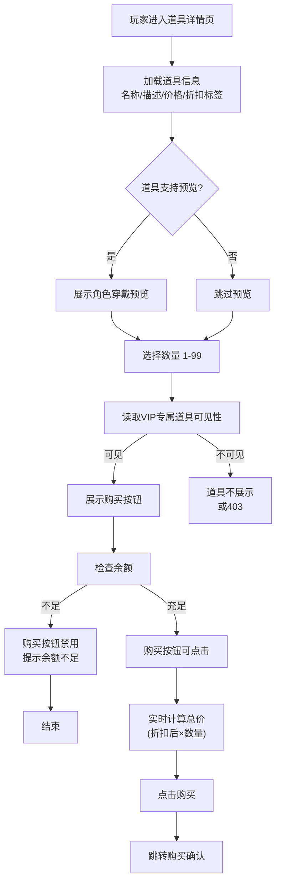
```mermaid
flowchart TD
    S4-UI-DETAIL-F01["玩家进入道具详情页"] --> S4-UI-DETAIL-F02["加载道具信息\n名称/描述/价格/折扣标签"]
    S4-UI-DETAIL-F02 --> S4-UI-DETAIL-F03{"道具支持预览?"}
    S4-UI-DETAIL-F03 -->|"是"| S4-UI-DETAIL-F04["展示角色穿戴预览"]
    S4-UI-DETAIL-F03 -->|"否"| S4-UI-DETAIL-F05["跳过预览"]
    S4-UI-DETAIL-F04 --> S4-UI-DETAIL-F06["选择数量 1-99"]
    S4-UI-DETAIL-F05 --> S4-UI-DETAIL-F06
    S4-UI-DETAIL-F06 --> S4-UI-DETAIL-F07["读取VIP专属道具可见性"]
    S4-UI-DETAIL-F07 -->|"可见"| S4-UI-DETAIL-F08["展示购买按钮"]
    S4-UI-DETAIL-F07 -->|"不可见"| S4-UI-DETAIL-F09["道具不展示\n或403"]
    S4-UI-DETAIL-F08 --> S4-UI-DETAIL-F10["检查余额"]
    S4-UI-DETAIL-F10 -->|"充足"| S4-UI-DETAIL-F11["购买按钮可点击"]
    S4-UI-DETAIL-F10 -->|"不足"| S4-UI-DETAIL-F12["购买按钮禁用\n提示余额不足"]
    S4-UI-DETAIL-F12 --> S4-UI-DETAIL-END1["结束"]
    S4-UI-DETAIL-F11 --> S4-UI-DETAIL-F13["实时计算总价\n(折扣后×数量)"]
    S4-UI-DETAIL-F13 --> S4-UI-DETAIL-F14["点击购买"]
    S4-UI-DETAIL-F14 --> S4-UI-DETAIL-END2["跳转购买确认"]
```

### 5.2 时序图（Sequence）

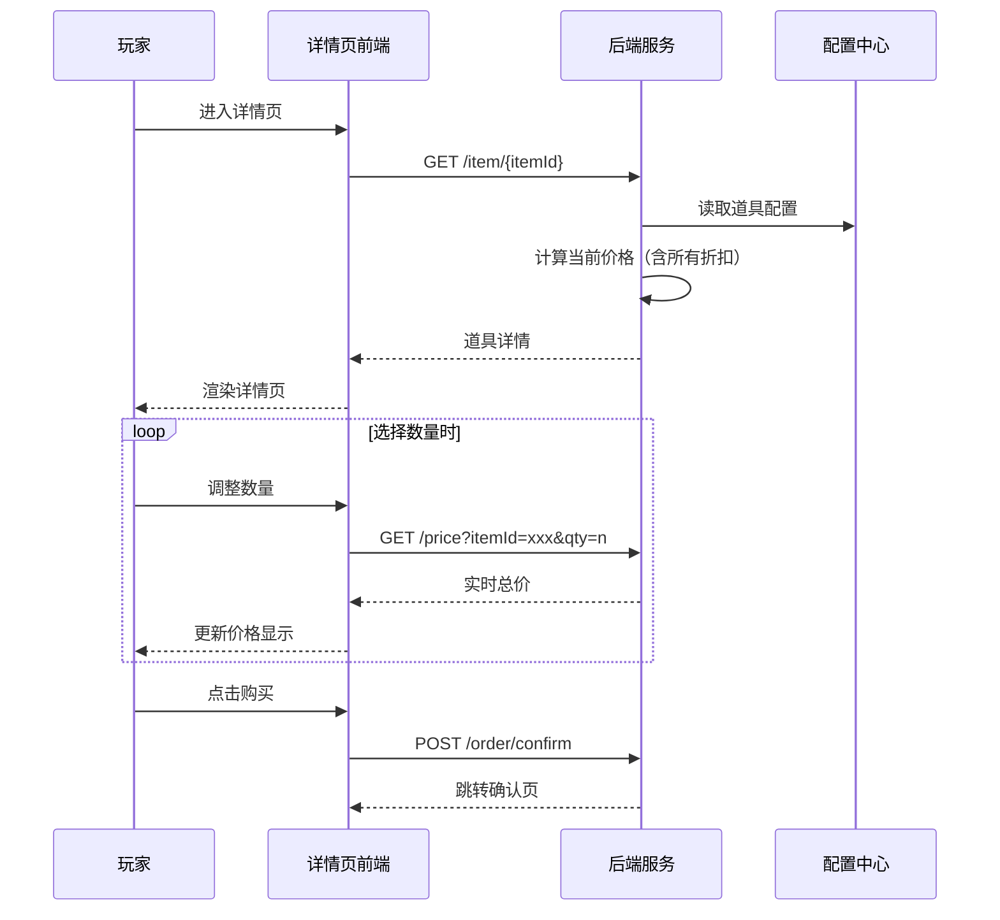
```mermaid
sequenceDiagram
    participant P as 玩家
    participant UI as 详情页前端
    participant SV as 后端服务
    participant CONFIG as 配置中心

    P->>UI: 进入详情页
    UI->>SV: GET /item/{itemId}
    SV->>CONFIG: 读取道具配置
    SV->>SV: 计算当前价格（含所有折扣）
    SV-->>UI: 道具详情
    UI-->>P: 渲染详情页
    loop 选择数量时
        P->>UI: 调整数量
        UI->>SV: GET /price?itemId=xxx&qty=n
        SV-->>UI: 实时总价
        UI-->>P: 更新价格显示
    end
    P->>UI: 点击购买
    UI->>SV: POST /order/confirm
    SV-->>UI: 跳转确认页
```

### 5.3 异常/错误决策树

```
S4-UI-DETAIL-1.0  详情页异常决策树
│
├── S4-UI-DETAIL-1.1  道具不存在
│   └── S4-UI-DETAIL-1.1.1  返回404 → 前端跳转商城首页
│
├── S4-UI-DETAIL-1.2  道具价格计算异常
│   ├── S4-UI-DETAIL-1.2.1  汇率获取失败 → 返回人民币原价 → 禁用RMB支付，仅显示游戏币价
│   ├── S4-UI-DETAIL-1.2.2  VIP等级无法读取 → 视为无折扣，按原价展示
│   └── S4-UI-DETAIL-1.2.3  促销配置读取失败 → 降级为原价 → 不阻塞购买
│
└── S4-UI-DETAIL-1.3  实时价格与结算价格不一致
    └── S4-UI-DETAIL-1.3.1  以结算页价格为准 → 详情页价格仅供参考
```

### 5.4 风险点

| 风险 ID（机器友好） | 风险 ID（人类可读） | 风险类型（7类） | 风险描述 | s4_reference | 异常树叶子 | 解决方案 |
|--------------------|--------------------|-----------------|----------|--------------|-----------|----------|
| R-015 | R-UI-DETAIL-01 | 竞态条件 | 价格更新竞态：详情页显示价格后折扣变更 | R-015 | S4-UI-DETAIL-1.3.1 | 订单创建时重新计算，详情页价格为参考 |
| R-016 | R-UI-DETAIL-02 | 安全/合规 | 数量选择XSS注入：特殊字符输入 | R-016 | S4-UI-DETAIL-1.2.1 | 前端数值类型强校验 |

---

## 6. BIZ-ORDER — 订单管理

### 6.1 主业务流程（Flowchart）

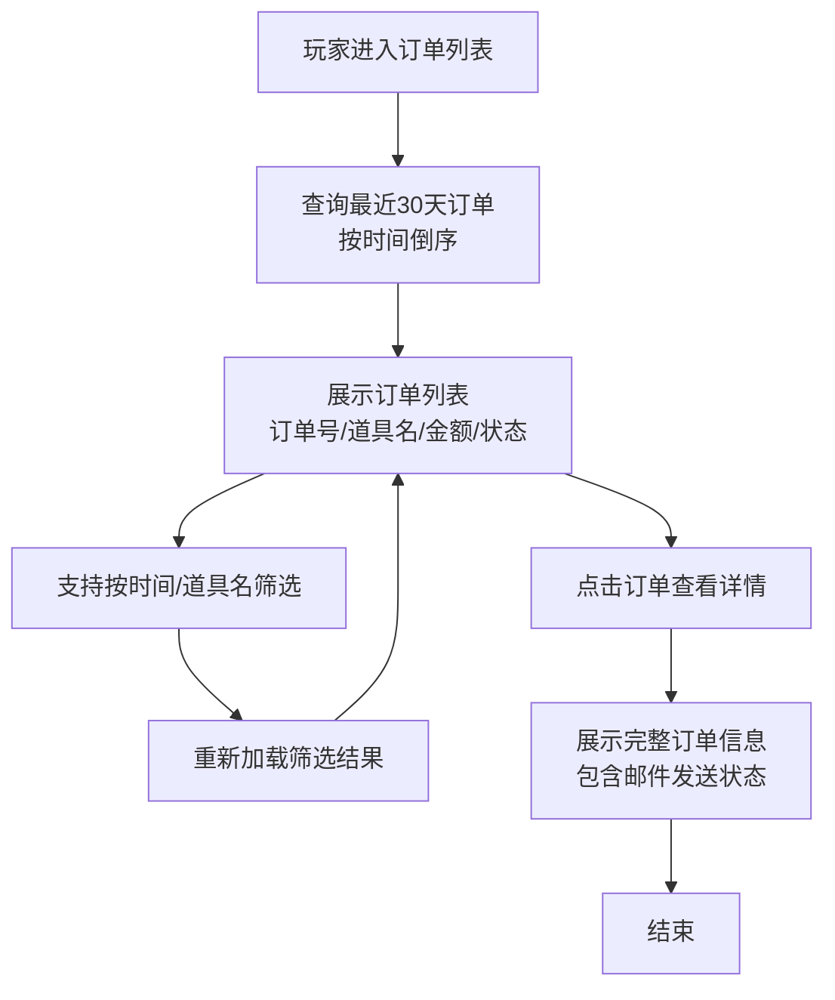
```mermaid
flowchart TD
    S4-BIZ-ORDER-F01["玩家进入订单列表"] --> S4-BIZ-ORDER-F02["查询最近30天订单\n按时间倒序"]
    S4-BIZ-ORDER-F02 --> S4-BIZ-ORDER-F03["展示订单列表\n订单号/道具名/金额/状态"]
    S4-BIZ-ORDER-F03 --> S4-BIZ-ORDER-F04["支持按时间/道具名筛选"]
    S4-BIZ-ORDER-F04 --> S4-BIZ-ORDER-F05["重新加载筛选结果"]
    S4-BIZ-ORDER-F05 --> S4-BIZ-ORDER-F03
    S4-BIZ-ORDER-F03 --> S4-BIZ-ORDER-F06["点击订单查看详情"]
    S4-BIZ-ORDER-F06 --> S4-BIZ-ORDER-F07["展示完整订单信息\n包含邮件发送状态"]
    S4-BIZ-ORDER-F07 --> S4-BIZ-ORDER-END["结束"]
```

### 6.2 时序图（Sequence）

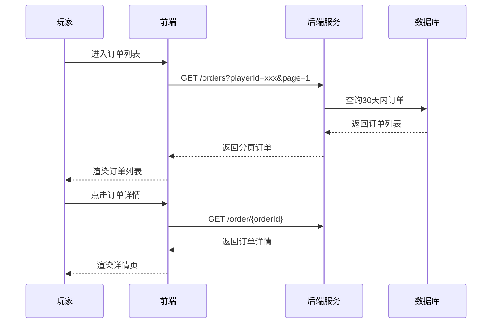
```mermaid
sequenceDiagram
    participant P as 玩家
    participant UI as 前端
    participant SV as 后端服务
    participant DB as 数据库

    P->>UI: 进入订单列表
    UI->>SV: GET /orders?playerId=xxx&page=1
    SV->>DB: 查询30天内订单
    DB-->>SV: 返回订单列表
    SV-->>UI: 返回分页订单
    UI-->>P: 渲染订单列表
    P->>UI: 点击订单详情
    UI->>SV: GET /order/{orderId}
    SV-->>UI: 返回订单详情
    UI-->>P: 渲染详情页
```

### 6.3 异常/错误决策树

```
S4-BIZ-ORDER-1.0  订单管理异常决策树
│
├── S4-BIZ-ORDER-1.1  订单列表为空
│   └── S4-BIZ-ORDER-1.1.1  正常展示空列表 → 提示「暂无购买记录」
│
├── S4-BIZ-ORDER-1.2  订单不存在/无权查看
│   └── S4-BIZ-ORDER-1.2.1  返回403 → 前端提示「订单不存在」
│
└── S4-BIZ-ORDER-1.3  订单详情邮件状态未更新
    └── S4-BIZ-ORDER-1.3.1  邮件发送失败 → 状态显示「发送中」 → 后台异步重试
```

### 6.4 风险点

| 风险 ID（机器友好） | 风险 ID（人类可读） | 风险类型（7类） | 风险描述 | s4_reference | 异常树叶子 | 解决方案 |
|--------------------|--------------------|-----------------|----------|--------------|-----------|----------|
| R-017 | R-BIZ-ORDER-01 | 时间依赖 | 30天边界：精确到天（UTC 00:00） | R-017 | S4-BIZ-ORDER-1.1.1 | SQL `DATE_SUB(NOW(), INTERVAL 30 DAY)` 比较 |

---

## 7. AUX-CACHE — 道具数据缓存

### 7.1 主业务流程（Flowchart）

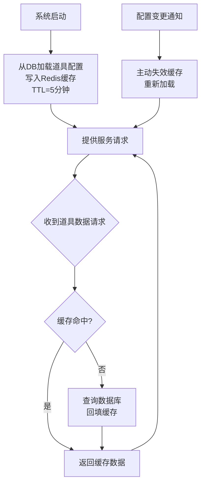
```mermaid
flowchart TD
    S4-AUX-CACHE-F01["系统启动"] --> S4-AUX-CACHE-F02["从DB加载道具配置\n写入Redis缓存\nTTL=5分钟"]
    S4-AUX-CACHE-F02 --> S4-AUX-CACHE-F03["提供服务请求"]
    S4-AUX-CACHE-F03 --> S4-AUX-CACHE-F04{"收到道具数据请求"}
    S4-AUX-CACHE-F04 --> S4-AUX-CACHE-F05{"缓存命中?"}
    S4-AUX-CACHE-F05 -->|"是"| S4-AUX-CACHE-F06["返回缓存数据"]
    S4-AUX-CACHE-F05 -->|"否"| S4-AUX-CACHE-F07["查询数据库\n回填缓存"]
    S4-AUX-CACHE-F07 --> S4-AUX-CACHE-F06
    S4-AUX-CACHE-F06 --> S4-AUX-CACHE-F03
    S4-AUX-CACHE-F08["配置变更通知"] --> S4-AUX-CACHE-F09["主动失效缓存\n重新加载"]
    S4-AUX-CACHE-F09 --> S4-AUX-CACHE-F03
```

### 7.2 时序图（Sequence）

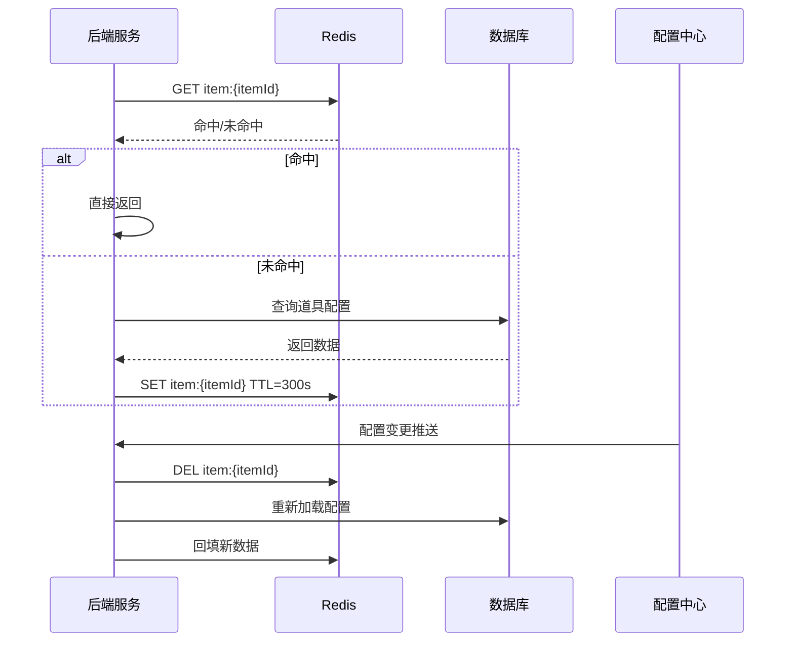
```mermaid
sequenceDiagram
    participant SV as 后端服务
    participant CACHE as Redis
    participant DB as 数据库
    participant CONFIG as 配置中心

    SV->>CACHE: GET item:{itemId}
    CACHE-->>SV: 命中/未命中
    alt 命中
        SV->>SV: 直接返回
    else 未命中
        SV->>DB: 查询道具配置
        DB-->>SV: 返回数据
        SV->>CACHE: SET item:{itemId} TTL=300s
    end
    CONFIG->>SV: 配置变更推送
    SV->>CACHE: DEL item:{itemId}
    SV->>DB: 重新加载配置
    SV->>CACHE: 回填新数据
```

### 7.3 异常/错误决策树

```
S4-AUX-CACHE-1.0  缓存异常决策树
│
├── S4-AUX-CACHE-1.1  Redis连接失败
│   └── S4-AUX-CACHE-1.1.1  降级为直查DB → 记录监控告警
│
├── S4-AUX-CACHE-1.2  缓存数据损坏/过期
│   └── S4-AUX-CACHE-1.2.1  重新从DB加载 → 更新缓存
│
└── S4-AUX-CACHE-1.3  配置变更推送失败
    └── S4-AUX-CACHE-1.3.1  等TTL自然过期（≤5min） → 不阻塞业务
```

### 7.4 风险点

| 风险 ID（机器友好） | 风险 ID（人类可读） | 风险类型（7类） | 风险描述 | s4_reference | 异常树叶子 | 解决方案 |
|--------------------|--------------------|-----------------|----------|--------------|-----------|----------|
| R-018 | R-AUX-CACHE-01 | 资源/容量 | 缓存击穿：道具缓存同时失效 + 大量请求 | R-018 | S4-AUX-CACHE-1.2.1 | 互斥锁（单机）或布隆过滤器 |
| R-019 | R-AUX-CACHE-02 | 时间依赖 | 缓存雪崩：大量道具同时过期 | R-019 | S4-AUX-CACHE-1.1.1 | 过期时间加随机偏移 |

---

## 8. AUX-EXRATE — 汇率配置

### 8.1 主业务流程（Flowchart）

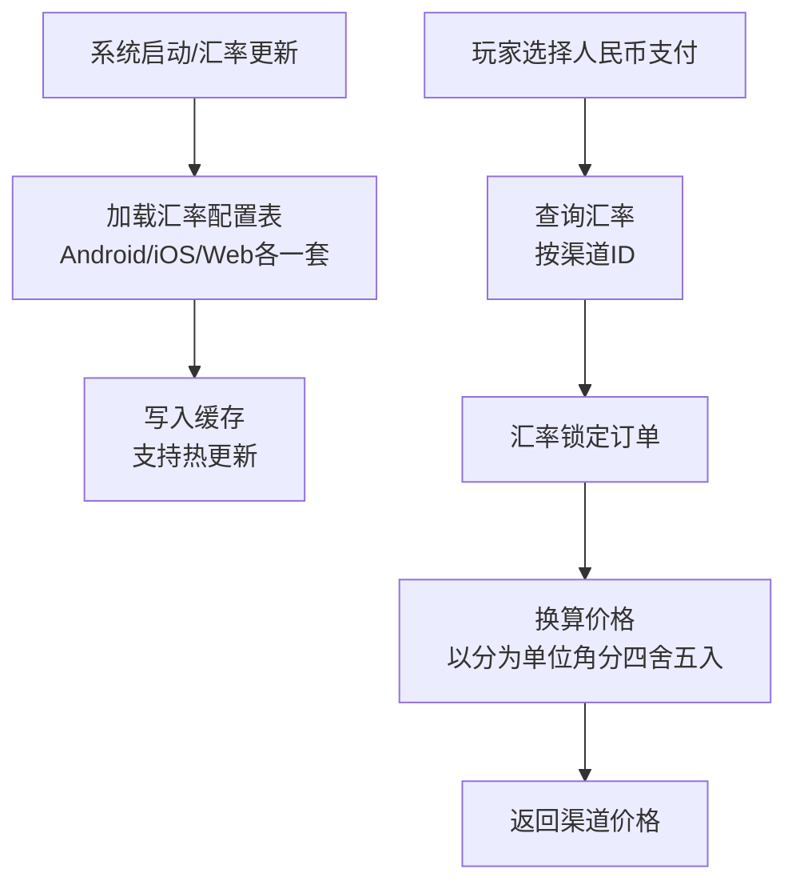
```mermaid
flowchart TD
    S4-AUX-EXRATE-F01["系统启动/汇率更新"] --> S4-AUX-EXRATE-F02["加载汇率配置表\nAndroid/iOS/Web各一套"]
    S4-AUX-EXRATE-F02 --> S4-AUX-EXRATE-F03["写入缓存\n支持热更新"]
    S4-AUX-EXRATE-F04["玩家选择人民币支付"] --> S4-AUX-EXRATE-F05["查询汇率\n按渠道ID"]
    S4-AUX-EXRATE-F05 --> S4-AUX-EXRATE-F06["汇率锁定订单"]
    S4-AUX-EXRATE-F06 --> S4-AUX-EXRATE-F07["换算价格\n以分为单位角分四舍五入"]
    S4-AUX-EXRATE-F07 --> S4-AUX-EXRATE-END["返回渠道价格"]
```

### 8.2 时序图（Sequence）

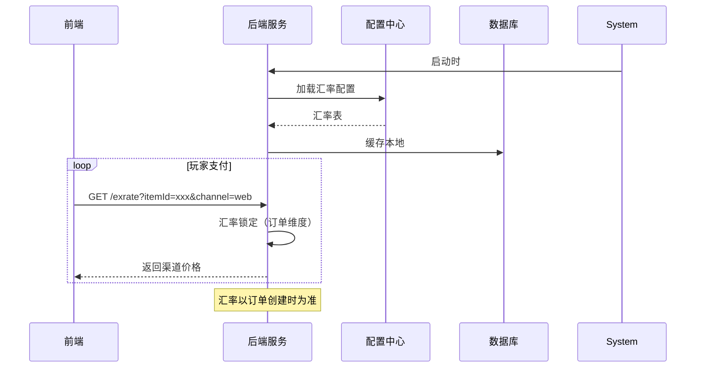
```mermaid
sequenceDiagram
    participant UI as 前端
    participant SV as 后端服务
    participant CONFIG as 配置中心
    participant DB as 数据库

    System->>SV: 启动时
    SV->>CONFIG: 加载汇率配置
    CONFIG-->>SV: 汇率表
    SV->>DB: 缓存本地
    loop 玩家支付
        UI->>SV: GET /exrate?itemId=xxx&channel=web
        SV->>SV: 汇率锁定（订单维度）
        SV-->>UI: 返回渠道价格
    end
    Note over SV: 汇率以订单创建时为准
```

### 8.3 异常/错误决策树

```
S4-AUX-EXRATE-1.0  汇率异常决策树
│
├── S4-AUX-EXRATE-1.1  汇率配置缺失（某渠道无汇率）
│   └── S4-AUX-EXRATE-1.1.1  禁用该渠道人民币支付 → 提示「该渠道暂不支持」
│
├── S4-AUX-EXRATE-1.2  汇率热更新失败
│   └── S4-AUX-EXRATE-1.2.1  继续使用旧汇率 → 记录告警
│
└── S4-AUX-EXRATE-1.3  汇率值非法（≤0）
    └── S4-AUX-EXRATE-1.3.1  拒绝加载 → 使用默认汇率1:1 → 记录错误日志
```

### 8.4 风险点

| 风险 ID（机器友好） | 风险 ID（人类可读） | 风险类型（7类） | 风险描述 | s4_reference | 异常树叶子 | 解决方案 |
|--------------------|--------------------|-----------------|----------|--------------|-----------|----------|
| R-020 | R-AUX-EXRATE-01 | 数据一致性 | 汇率锁定不一致：同一订单两次计算汇率不同 | R-020 | S4-AUX-EXRATE-1.1.1 | 订单表存汇率快照，不查实时汇率 |

---

## 9. LINK-PAYMENT — 支付接口

### 9.1 主业务流程（Flowchart）

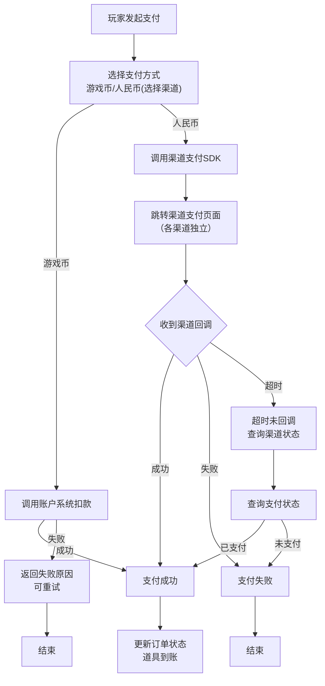
```mermaid
flowchart TD
    S4-LINK-PAYMENT-F01["玩家发起支付"] --> S4-LINK-PAYMENT-F02["选择支付方式\n游戏币/人民币(选择渠道)"]
    S4-LINK-PAYMENT-F02 -->|"游戏币"| S4-LINK-PAYMENT-F03["调用账户系统扣款"]
    S4-LINK-PAYMENT-F02 -->|"人民币"| S4-LINK-PAYMENT-F04["调用渠道支付SDK"]
    S4-LINK-PAYMENT-F03 -->|"成功"| S4-LINK-PAYMENT-F05["支付成功"]
    S4-LINK-PAYMENT-F03 -->|"失败"| S4-LINK-PAYMENT-F06["返回失败原因\n可重试"]
    S4-LINK-PAYMENT-F04 --> S4-LINK-PAYMENT-F07["跳转渠道支付页面\n（各渠道独立）"]
    S4-LINK-PAYMENT-F07 --> S4-LINK-PAYMENT-F08{"收到渠道回调"}
    S4-LINK-PAYMENT-F08 -->|"成功"| S4-LINK-PAYMENT-F05
    S4-LINK-PAYMENT-F08 -->|"失败"| S4-LINK-PAYMENT-F09["支付失败"]
    S4-LINK-PAYMENT-F08 -->|"超时"| S4-LINK-PAYMENT-F10["超时未回调\n查询渠道状态"]
    S4-LINK-PAYMENT-F10 --> S4-LINK-PAYMENT-F11["查询支付状态"]
    S4-LINK-PAYMENT-F11 -->|"已支付"| S4-LINK-PAYMENT-F05
    S4-LINK-PAYMENT-F11 -->|"未支付"| S4-LINK-PAYMENT-F09
    S4-LINK-PAYMENT-F05 --> S4-LINK-PAYMENT-END1["更新订单状态\n道具到账"]
    S4-LINK-PAYMENT-F06 --> S4-LINK-PAYMENT-END2["结束"]
    S4-LINK-PAYMENT-F09 --> S4-LINK-PAYMENT-END3["结束"]
```

### 9.2 时序图（Sequence）

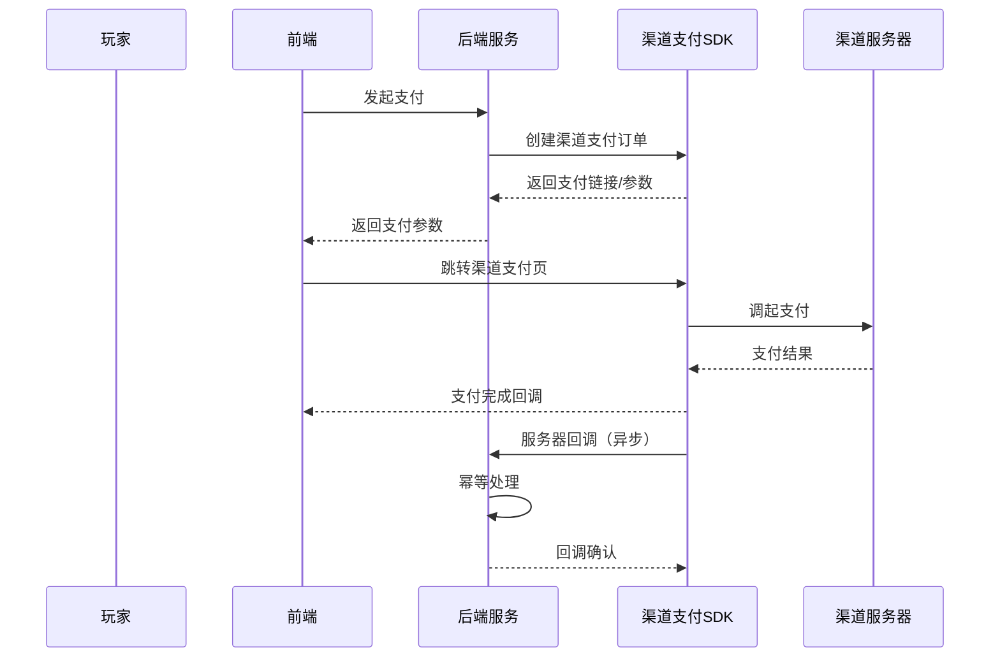
```mermaid
sequenceDiagram
    participant P as 玩家
    participant UI as 前端
    participant SV as 后端服务
    participant PAY as 渠道支付SDK
    participant CH as 渠道服务器

    UI->>SV: 发起支付
    SV->>PAY: 创建渠道支付订单
    PAY-->>SV: 返回支付链接/参数
    SV-->>UI: 返回支付参数
    UI->>PAY: 跳转渠道支付页
    PAY->>CH: 调起支付
    CH-->>PAY: 支付结果
    PAY-->>UI: 支付完成回调
    PAY->>SV: 服务器回调（异步）
    SV->>SV: 幂等处理
    SV-->>PAY: 回调确认
```

### 9.3 异常/错误决策树

```
S4-LINK-PAYMENT-1.0  支付接口异常决策树
│
├── S4-LINK-PAYMENT-1.1  渠道支付创建失败
│   ├── S4-LINK-PAYMENT-1.1.1  SDK初始化失败 → 返回「支付通道维护中」→ 提示切换支付方式
│   ├── S4-LINK-PAYMENT-1.1.2  签名生成失败 → 返回错误 → 重试
│   └── S4-LINK-PAYMENT-1.1.3  渠道服务不可用 → 降级提示 → 建议游戏币支付
│
├── S4-LINK-PAYMENT-1.2  渠道回调失败/重复
│   ├── S4-LINK-PAYMENT-1.2.1  签名校验失败 → 忽略 → 不处理
│   ├── S4-LINK-PAYMENT-1.2.2  订单号不存在 → 忽略 → 记录日志
│   └── S4-LINK-PAYMENT-1.2.3  重复回调（幂等）→ 已处理则忽略 → 返回success防重复
│
└── S4-LINK-PAYMENT-1.3  支付状态查询异常
    └── S4-LINK-PAYMENT-1.3.1  超时 → 标记「支付状态待确认」→ 定时任务轮询
```

### 9.4 风险点

| 风险 ID（机器友好） | 风险 ID（人类可读） | 风险类型（7类） | 风险描述 | s4_reference | 异常树叶子 | 解决方案 |
|--------------------|--------------------|-----------------|----------|--------------|-----------|----------|
| R-021 | R-LINK-PAYMENT-01 | 支付幂等性 | 渠道重复推送回调 | R-021 | S4-LINK-PAYMENT-1.2.3 | 订单号唯一 + 已处理标记 |
| R-022 | R-LINK-PAYMENT-02 | 竞态条件 | 游戏币并发扣款：同一玩家并发多笔支付 | R-022 | S4-LINK-PAYMENT-1.1.1 | 余额冻结机制 |
| R-023 | R-LINK-PAYMENT-03 | 安全/合规 | 渠道回调安全性：伪造回调 | R-023 | S4-LINK-PAYMENT-1.2.1 | 签名校验 + 回调IP白名单 |

---

## 10. LOG-PAYMENT — 支付日志

### 10.1 主业务流程（Flowchart）

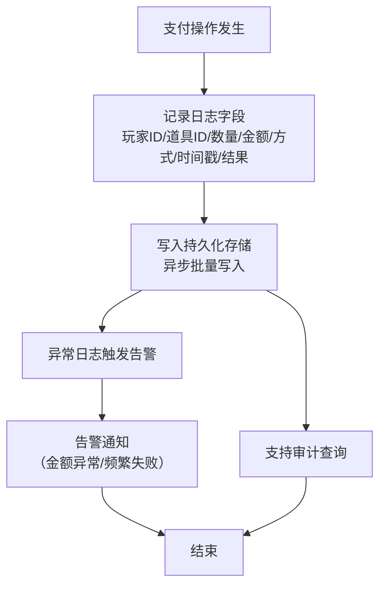
```mermaid
flowchart TD
    S4-LOG-PAYMENT-F01["支付操作发生"] --> S4-LOG-PAYMENT-F02["记录日志字段\n玩家ID/道具ID/数量/金额/方式/时间戳/结果"]
    S4-LOG-PAYMENT-F02 --> S4-LOG-PAYMENT-F03["写入持久化存储\n异步批量写入"]
    S4-LOG-PAYMENT-F03 --> S4-LOG-PAYMENT-F04["支持审计查询"]
    S4-LOG-PAYMENT-F03 --> S4-LOG-PAYMENT-F05["异常日志触发告警"]
    S4-LOG-PAYMENT-F05 --> S4-LOG-PAYMENT-F06["告警通知\n（金额异常/频繁失败）"]
    S4-LOG-PAYMENT-F06 --> S4-LOG-PAYMENT-END["结束"]
    S4-LOG-PAYMENT-F04 --> S4-LOG-PAYMENT-END
```

### 10.2 时序图（Sequence）

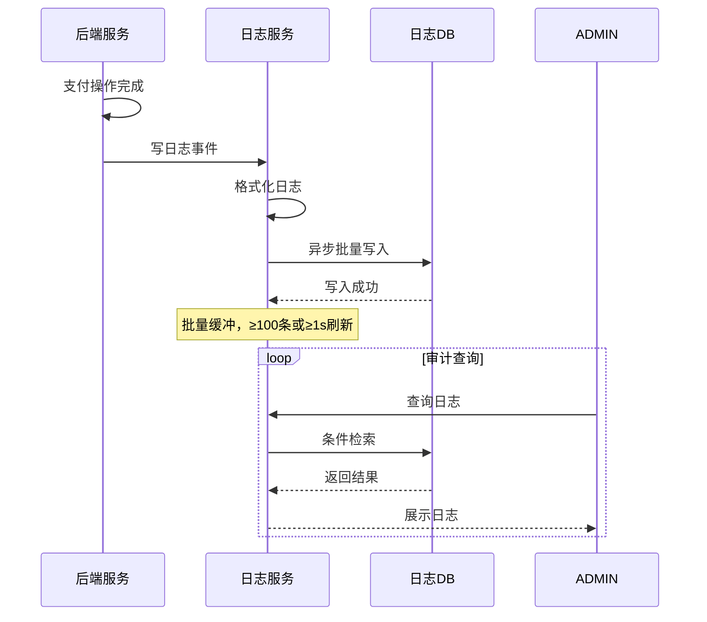
```mermaid
sequenceDiagram
    participant SV as 后端服务
    participant LOG as 日志服务
    participant DB as 日志DB

    SV->>SV: 支付操作完成
    SV->>LOG: 写日志事件
    LOG->>LOG: 格式化日志
    LOG->>DB: 异步批量写入
    DB-->>LOG: 写入成功
    Note over LOG: 批量缓冲，≥100条或≥1s刷新
    loop 审计查询
        ADMIN->>LOG: 查询日志
        LOG->>DB: 条件检索
        DB-->>LOG: 返回结果
        LOG-->>ADMIN: 展示日志
    end
```

### 10.3 异常/错误决策树

```
S4-LOG-PAYMENT-1.0  支付日志异常决策树
│
├── S4-LOG-PAYMENT-1.1  日志写入失败
│   ├── S4-LOG-PAYMENT-1.1.1  磁盘空间不足 → 告警 → 扩展存储 → 优先写内存缓冲区
│   └── S4-LOG-PAYMENT-1.1.2  日志DB连接失败 → 写本地文件降级 → 后续补录
│
└── S4-LOG-PAYMENT-1.2  日志字段缺失
    └── S4-LOG-PAYMENT-1.2.1  标记为「字段异常」→ 不影响业务流程
```

### 10.4 风险点

| 风险 ID（机器友好） | 风险 ID（人类可读） | 风险类型（7类） | 风险描述 | s4_reference | 异常树叶子 | 解决方案 |
|--------------------|--------------------|-----------------|----------|--------------|-----------|----------|
| R-024 | R-LOG-PAYMENT-01 | 数据一致性 | 日志丢失：服务崩溃时内存缓冲未刷新 | R-024 | S4-LOG-PAYMENT-1.1.1 | 定期强制刷盘（≤1s） |
| R-025 | R-LOG-PAYMENT-02 | 安全/合规 | 日志篡改：核心字段（金额）被修改 | R-025 | S4-LOG-PAYMENT-1.2.1 | append-only日志表 + 权限隔离 |

---

## 11. SPECIAL-VIP-CHANGE — VIP等级变更

### 11.1 主业务流程（Flowchart）

```mermaid
flowchart TD
    S4-SPECIAL-VIP-CHANGE-F01["VIP等级配置变更\n（策划修改/系统考核）"] --> S4-SPECIAL-VIP-CHANGE-F02["查询受影响玩家列表"]
    S4-SPECIAL-VIP-CHANGE-F02 --> S4-SPECIAL-VIP-CHANGE-F03{"遍历玩家"}
    S4-SPECIAL-VIP-CHANGE-F03 -->|"有玩家"| S4-SPECIAL-VIP-CHANGE-F04["更新玩家VIP等级\n写入DB"]
    S4-SPECIAL-VIP-CHANGE-F04 --> S4-SPECIAL-VIP-CHANGE-F05["通知全服\n玩家折扣实时生效"]
    S4-SPECIAL-VIP-CHANGE-F05 --> S4-SPECIAL-VIP-CHANGE-F03
    S4-SPECIAL-VIP-CHANGE-F03 -->|"全部完成"| S4-SPECIAL-VIP-CHANGE-END1["等级变更完成"]
    S4-SPECIAL-VIP-CHANGE-F06["玩家下次购买"] --> S4-SPECIAL-VIP-CHANGE-F07["读取最新VIP等级\n判定折扣"]
    S4-SPECIAL-VIP-CHANGE-F07 --> S4-SPECIAL-VIP-CHANGE-F08["应用新折扣\n以新等级为准"]
    S4-SPECIAL-VIP-CHANGE-F08 --> S4-SPECIAL-VIP-CHANGE-END2["结束"]
```

### 11.2 时序图（Sequence）

```mermaid
sequenceDiagram
    participant ADMIN as 策划/系统
    participant SV as 后端服务
    participant CONFIG as 配置中心
    participant DB as 数据库
    participant P as 玩家

    ADMIN->>SV: 修改VIP配置
    SV->>DB: 更新玩家等级表
    SV->>CONFIG: 热更新配置
    CONFIG-->>SV: 更新成功
    Note over SV: 全服实时生效
    loop 每次购买
        P->>SV: 发起购买
        SV->>CONFIG: 读取最新VIP等级
        SV->>DB: 查询玩家当前VIP等级
        SV->>SV: 按新等级计算折扣
        SV-->>P: 返回含折扣价格
    end
```

### 11.3 异常/错误决策树

```
S4-SPECIAL-VIP-CHANGE-1.0  VIP等级变更异常决策树
│
├── S4-SPECIAL-VIP-CHANGE-1.1  等级时效到期处理
│   ├── S4-SPECIAL-VIP-CHANGE-1.1.1  配置为「降级」→ 降至对应等级 → 实时生效
│   ├── S4-SPECIAL-VIP-CHANGE-1.1.2  配置为「保留资格」→ 等级不变 → 记录变更日志
│   └── S4-SPECIAL-VIP-CHANGE-1.1.3  配置为「无时效」→ 永久有效 → 不触发变更
│
├── S4-SPECIAL-VIP-CHANGE-1.2  配置表等级规则变更（不是玩家等级变更）
│   └── S4-SPECIAL-VIP-CHANGE-1.2.1  新玩家立即应用 → 已购玩家下次购买时应用
│
└── S4-SPECIAL-VIP-CHANGE-1.3  等级变更通知失败
    └── S4-SPECIAL-VIP-CHANGE-1.3.1  重试3次 → 失败记录DB → 后台任务补偿
```

### 11.4 风险点

| 风险 ID（机器友好） | 风险 ID（人类可读） | 风险类型（7类） | 风险描述 | s4_reference | 异常树叶子 | 解决方案 |
|--------------------|--------------------|-----------------|----------|--------------|-----------|----------|
| R-026 | R-SPECIAL-VIP-CHANGE-01 | 状态损坏 | 等级判定时间窗口：玩家购买进行中配置变更 | R-026 | S4-SPECIAL-VIP-CHANGE-1.2.1 | 以订单创建时刻的等级为准 |

---

## 风险点汇总（全局）

| 风险ID | Epic | 模块 | 风险类型 | 风险描述 | 解决方案 | s4_reference | 异常树叶子 |
|--------|------|------|---------|----------|----------|--------------|-----------|
| R-001 | BIZ-PURCHASE | BIZ | 竞态条件 | 余额冻结前并发请求导致重复扣款 | 先冻结再校验 | R-001 | S4-BIZ-PURCHASE-1.3.2 |
| R-002 | BIZ-PURCHASE | BIZ | 支付幂等性 | 渠道回调重复推送 | 订单号唯一约束 | R-002 | S4-BIZ-PURCHASE-1.4.2 |
| R-003 | BIZ-PURCHASE | BIZ | 时间依赖 | 汇率支付中变更 | 订单创建时锁定汇率 | R-003 | S4-BIZ-PURCHASE-1.4.3 |
| R-004 | BIZ-PURCHASE | BIZ | 数据一致性 | 扣款成功但到账失败 | 事务内操作+全量回滚 | R-004 | S4-BIZ-PURCHASE-1.3.3 / S4-BIZ-PURCHASE-1.5.1 |
| R-005 | BIZ-PURCHASE | BIZ | 资源/容量 | 邮件异步发送失败 | DB记录+重试机制 | R-005 | S4-BIZ-PURCHASE-1.6.1 |
| R-006 | CONFIG-VIP | CONFIG | 状态损坏 | 配置热更新与购买流程交叉 | 以变更时间点为分界 | R-006 | S4-CONFIG-VIP-1.3.2 |
| R-007 | CONFIG-VIP | CONFIG | 时间依赖 | VIP等级读取延迟 | 配置中心推送 + 缓存失效TTL ≤ 5s | R-007 | S4-CONFIG-VIP-1.2.1 |
| R-008 | CONFIG-VIP | CONFIG | 业务规则 | 折扣叠加二义性 | 配置表优先级字段决定 | R-008 | S4-CONFIG-VIP-1.1.2 |
| R-009 | CONFIG-DISCOUNT | CONFIG | 时间依赖 | 促销时间边界精确性 | 以服务器时间戳为准（秒级） | R-009 | S4-CONFIG-DISCOUNT-1.1.1 / S4-CONFIG-DISCOUNT-1.3.3 |
| R-010 | CONFIG-DISCOUNT | CONFIG | 安全/合规 | 新手礼包多设备绕过限制 | 订单级唯一约束 | R-010 | S4-CONFIG-DISCOUNT-1.3.2 |
| R-011 | CONFIG-DISCOUNT | CONFIG | 数据一致性 | 满减精度（角分四舍五入） | 以分为单位 | R-011 | S4-CONFIG-DISCOUNT-1.2.3 |
| R-012 | UI-SHOP | UI | 资源/容量 | 缓存雪崩（同时失效） | 过期时间加随机偏移 | R-012 | S4-UI-SHOP-1.1.2 |
| R-013 | UI-SHOP | UI | 安全/合规 | 搜索SQL注入 | 参数化查询 | R-013 | S4-UI-SHOP-1.2.2 |
| R-014 | UI-SHOP | UI | 时间依赖 | 热门道具变更延迟 | 配置变更主动失效缓存 | R-014 | S4-UI-SHOP-1.1.2 |
| R-015 | UI-DETAIL | UI | 竞态条件 | 详情页价格与结算价格不一致 | 以结算页为准 | R-015 | S4-UI-DETAIL-1.3.1 |
| R-016 | UI-DETAIL | UI | 安全/合规 | 数量选择XSS注入 | 前端数值类型强校验 | R-016 | S4-UI-DETAIL-1.2.1 |
| R-017 | BIZ-ORDER | BIZ | 时间依赖 | 30天边界 | SQL `DATE_SUB(NOW(), INTERVAL 30 DAY)` | R-017 | S4-BIZ-ORDER-1.1.1 |
| R-018 | AUX-CACHE | AUX | 资源/容量 | 缓存击穿（同时大量请求） | 互斥锁/布隆过滤器 | R-018 | S4-AUX-CACHE-1.2.1 |
| R-019 | AUX-CACHE | AUX | 时间依赖 | 缓存雪崩（同时过期） | 过期时间加随机偏移 | R-019 | S4-AUX-CACHE-1.1.1 |
| R-020 | AUX-EXRATE | AUX | 数据一致性 | 汇率锁定不一致 | 订单表存汇率快照 | R-020 | S4-AUX-EXRATE-1.1.1 |
| R-021 | LINK-PAYMENT | LINK | 支付幂等性 | 渠道回调伪造/重复 | 签名校验 + IP白名单 | R-021 | S4-LINK-PAYMENT-1.2.3 |
| R-022 | LINK-PAYMENT | LINK | 竞态条件 | 游戏币并发扣款 | 余额冻结机制 | R-022 | S4-LINK-PAYMENT-1.1.1 |
| R-023 | LINK-PAYMENT | LINK | 安全/合规 | 渠道回调安全性 | 签名校验 + 回调IP白名单 | R-023 | S4-LINK-PAYMENT-1.2.1 |
| R-024 | LOG-PAYMENT | LOG | 数据一致性 | 服务崩溃时日志丢失 | 定期强制刷盘（≤1s） | R-024 | S4-LOG-PAYMENT-1.1.1 |
| R-025 | LOG-PAYMENT | LOG | 安全/合规 | 日志篡改 | append-only日志表 | R-025 | S4-LOG-PAYMENT-1.2.1 |
| R-026 | SPECIAL-VIP-CHANGE | SPECIAL | 状态损坏 | 购买进行中等级变更 | 以订单创建时等级为准 | R-026 | S4-SPECIAL-VIP-CHANGE-1.2.1 |
| R-027 | ALL | BIZ | 时间依赖 | 跨时区时间判定不一致 | 统一使用UTC时间 | R-027 | S4-BIZ-PURCHASE-1.6.1 |

---

*由 AIDocxWorkFlow S4 流程图导出生成（v1.1+ 重构）*
*4 类产出：Flowchart + Sequence + 异常决策树 + 风险点清单*
*风险点 ID 格式：`R-NNN`（机器） / `R-{EpicID}-NN`（人类可读）*
*异常树叶子 ID 格式：`S4-{EpicID}-X.Y.Z`*
*流程图节点 ID 格式：`S4-{EpicID}-FNN`（推荐，可选）*
*S7 100% 覆盖率审计的 SSoT——所有风险点 ID 与异常树叶子 ID 全量列出*